# PATS

_version 0.1 | 20-Dec-2023_

## Table of Contents

1.  [Key design factors](#1-key-design-factors)
2.  [EDF checks](#2-edf-checks)
3.  [Identifiers](#3-identifiers)
4.  [Signal review](#4-signal-review)
5.  [Annotation review](#5-annotation-review)
6.  [Manual staging](#6-manual-staging)
7.  [Encodings](#7-encodings)
8.  [Quality control](#8-quality-control)
9.  [Interim report](#9-interim-report)
10.  [Running NAP](#10-running-nap)
11. [Compiling the distribution dataset](#11-compiling-the-distribution-dataset)
12. [Depositing an _as is_ dataset](#12-depositing-an-as-is-dataset)
13. [Polarity checks](#13-polarity-checks)

### ERIS Folder structure

| Folder                         | Description                      |
| ------------------------------ | -------------------------------- |
| `/data/nsrr/working/pats/`      | Working directory for processing |

We also create the following key folders in the working directory:

| Folder name | Contents                                                                                                      |
| ----------- | ------------------------------------------------------------------------------------------------------------- |
| `files/`    | Other relevant, original non-data files (e.g. descriptive PDFs, meta-data as XLS/PPTs, etc)                   |
| `sl/`       | All derived sample lists and other ID lists (e.g. ID exclusions)                                              |
| `tmp/`      | Scratch folder, e.g. including all raw outputs from Luna runs (`.db` files prior to extraction to `res/` etc) |
| `cmd/`      | Any Luna scripts                                                                                              |
| `res/`      | Final compiled/merged/derived _higher-level_ outputs, e.g. typically compiled from `tmp/`                     |
| `nap/`      | NAP automatically generates this folder with NAP output and harmonized EDFs/annotations                       |
| `dist/`     | Final distribution folder, i.e. copied EDFs/annotations from `nap/` that will be imported into NSRR           |

```
cd /data/nsrr/working/pats
mkdir files sl tmp derived res nap dist cmd
```

## 1) Key design factors

There are 704 individuals with one edf (`baseline`) and 306 individuals with two EDFs (`baseline` and `followup`):

```
ls nsrr_transfer/*.edf | wc -l
1010
```
Key demographic data are in
`files/pats-public-id-demo-20240211-with-lights.csv`.<br> 
Here we'll make a version with distribution IDs, with `pats` prefixes, and save a reformatted tab-delimited file.

```R
library(dplyr)
library(stringr)

d1 <- read.csv("files/pats-public-id-demo-20240211-with-lights.csv")
d1$ID <- gsub(".edf", "", d1$edf_name)
d1 <- d1[ , c( "ID" , "age_at_sleep_study", "ciw_sex" , "ciw_race7", "ciw_ethnicity", "public_site_id" ) ]
# check for missing data
table( complete.cases( d1 ) )

# Reformat
names(d1) <- c("ID","age","sex","race","ethnicity", "site")

d1 <- d1 %>% mutate(iid = str_extract(ID, "^[^-]*-[^-]*"))

# Remove characters until the first alphabet
d1$race <- sub("^[^A-Za-z]*", "", d1$race)
d1$ethnicity <- sub("^[^A-Za-z]*", "", d1$ethnicity)

d1$sex <- ifelse( d1$sex == "1: Male" , "M", d1$sex )
d1$sex <- ifelse( d1$sex == "2: Female" , "F", d1$sex )

write.table( d1 , file="files/demo.txt" , sep="\t" , row.names=F, quote=F, col.names=T)
```


#### List of PSG equipment from each site for PATS:

* `Site 1` – CHOP: Make EMBLA Model N7000, Cap = Capnocheck Plus/Combim54 (Smith Medical, Radiometer) and oximeter = Nonin; changed equipment 6/2018 to Make Nihon Kohden America Model Polysmith 11 with same Cap and built in oximeter (NK)
* `Site 2` – CLEVE: clinical units Make EMBLA Model S4500/N7000, Cap = BCI and oximeter = Nonin; changed the clinical units in 2019 to Make Natus Model Embla Dx with same Cap and built in oximeter Nonin, research units Make Compumedics Model Grael, Cap = Capnocheck Sleep
* `Site 3` – CINN: Make Grass Model Comet Plus [Twin software], Cap = BCI/Capnocheck and oximeter = Nonin and Masimo, 2017 Software upgrade; changed equipment in 2019 Make Neurovirtual Model SleepVirtual, same Cap [Cap waveform is not correct for EtCO2 analysis] and oximeter = Masimo Radical 7
* `Site 4` – MICH: Make Compumedics Model E-Series [has 4 leg inputs], Cap = Nonin Respsense with built in oximeter Nonin; changed equipment in 2018 Make Compumedics Model Grael V2 [has 4 leg inputs], same Cap and built in oximeter = Nonin,  Grael V2 Software upgrade 2018 [has 2 Leg inputs]
* `Site 5` – Dallas: Make Nihon Kohden Model Neurofax, Cap = RespSense LS1-R-9R (Nonin) with built in oximeter Nihon Kohden; added more beds and software upgrade in 2017 same type units but Cap = Capnocheck Sleep 9004
* `Site 6` – Boston-[BCH]: [only one child enrolled] Make Natus Model Sleepworks – Brain Monitor, Cap = NM3 Respiratory Profile Monitor (Philips Respironics) and built in oximeter Nonin and external Masimo
* `Site 7` – VA-CHKD: Make Cadwell Model Easy III, CAP = Nonin Respense LS1R-9R and built in oximeter


## 2) EDF checks

We first build an EDF-only sample list (`sl/s0.lst`)

```
luna --build nsrr_transfer > sl/s0.lst
```

```
wrote 1010 EDFs to the sample list
  1010 of which had 0 linked annotation files
```

Checking the validity of all EDFs:

```
luna sl/s0.lst -s DESC
```

(Found 1 corrupt EDF `pats-813652-baseline`)<br>
<br>
Running `HEADERS` to summarize EDF headers:
```
luna sl/s0.lst -o tmp/headers.db -s HEADERS signals
```
749 files are standard EDFs (i.e. continuous and without EDF Annotations)<br>
and 261 files with uninterrupted recordings (with EDF Annotations).

```
destrat tmp/headers.db +HEADERS -v EDF_TYPE  | cut -f2 | sort | uniq -c
```

```
749 EDF
261 EDF+C
```

The longest studies are around 12 hours:

```
destrat tmp/headers.db +HEADERS -v TOT_DUR_SEC | sort --key=2 -nr | head -5
```

```
pats-807645-baseline	46049
pats-805177-baseline	45779
pats-810955-followup	45660
pats-802413-baseline	44546
pats-808685-baseline	44236
```
There are no short recordings (less than 2 hours)

```
destrat tmp/headers.db +HEADERS -v TOT_DUR_SEC | sort --key=2 -n | awk ' { print $1,$2  } ' | head -6
```

<pre>
ID      TOT_DUR_SEC
pats-809408-baseline 13428
pats-805603-baseline 17127
pats-800740-followup 25639
pats-800763-baseline 26932
pats-810651-baseline 27605
</pre>

All EDFs have the same, standard EDF record size (1 second):
```
destrat tmp/headers.db +HEADERS -v REC_DUR | cut -f2 | sort | uniq -c
```
```
1010 1
```
Checking sample rates, most are standard (i.e. no very high sample rates, e.g. from raw audio):
Few channels have exhibited unusual sample rates, distinctively different from the standard.<br>
The channels are recording at sample rates of `258`, `276`, and `287`, respectively 
Such deviations from the norm are uncommon and could potentially indicate underlying issues with the recording process or equipment.<br>
It is important that we conduct a investigation into these channels. This may involve looking into the raw signal, reviewing the recording setup,<br> 
and any environmental factors that could have influenced the data integrity during the capture phase.

```
destrat tmp/headers.db +HEADERS -r CH -v SR | cut -f3 | sort | uniq -c
```

```
24 1
263 10
344 100
8 128
592 16
16346 200
238 25
2182 250
4704 256
1 258
1 276
1 287
1039 300
1397 32
1 383
190 40
717 50
24 500
2337 512
883 64
```
## 3) Identifiers

The EDF file names are used as the primary signal IDs:

```
ls nsrr_transfer/*.edf | sed 's/\.edf//g' | cut -d"/" -f2 > tmp/ids
```

```
head tmp/ids

pats-800003-baseline
pats-800022-baseline
pats-800022-followup
pats-800105-baseline
pats-800135-baseline
```
### PHI scanning

We checked based on EDF headers:

```
destrat tmp/headers.db +HEADERS -v START_DATE EDF_ID
```
Reviewing these outputs, we see they contain date information.  
These will be anonymozed by NAP (with `ANON`) along with the EDF `Recording info` field, when making the<br>
final harmonized EDFs.  All dates will be set to the default/null date
of `01.01.85` as per EDF specification.

We have identified a total of `261` individuals whose EDF files contain `EDF Annotations`.<br>
There is a potential that these annotations may include Protected Health Information (PHI).
```
destrat tmp/headers.db +HEADERS -v EDF_TYPE | awk -F'\t' '$2 ~ /EDF\+C/ { print; count++ } END { print "Total Matches: " count }'
```
```
pats-800666-followup	EDF+C
pats-800767-baseline	EDF+C
pats-800767-followup	EDF+C
pats-800778-followup	EDF+C
pats-800823-baseline	EDF+C

Total Matches: 261
```
```
head sl/edfc.lst

pats-800666-followup	nsrr_transfer/pats-800666-followup.edf	.
pats-800767-baseline	nsrr_transfer/pats-800767-baseline.edf	.
pats-800767-followup	nsrr_transfer/pats-800767-followup.edf	.
pats-800778-followup	nsrr_transfer/pats-800778-followup.edf	.
pats-800823-baseline	nsrr_transfer/pats-800823-baseline.edf	.
```
The `ANNOTS` command can be used to tabulate the annotations.
```
luna sl/edfc.lst -o tmp/edfc_annots.db -s ANNOTS
```
```
destrat tmp/edfc_annots.db +ANNOTS -r ANNOT INST T > tmp/edfc_annot.txt
```
To facilitate a detailed review, We have extracted these annotations to a separate file `edfc_annot.txt`.<br> 
It is crucial that we go through these annotations meticulously to ascertain if they contain any PHI information and <br>
to remove or de-identify the those information from the EDF files.

## 4) Signal review

The goal of this step is provide a general sense of the scope, variety
and consistency of channels across EDFs in the cohort, as a precursor
to running NAP.

We first enumerate all channel labels across the dataset:

```
destrat tmp/headers.db +HEADERS -r CH | awk ' NR != 1 { print $2 } ' | sort | uniq -c | sort -nr > tmp/channels
```
```
cat tmp/channels

1010 DHR
1009 SpO2
1008 CannulaFlow
996 Pleth
928 Snore
904 Airflow
901 EtCO2
861 Chest
831 ABD
776 ECG1
762 RChin
762 LChin
750 CChin
656 RLeg
656 LLeg
619 Cap
559 O2
559 O1
559 M2
559 M1
559 F4
559 E2
559 E1
559 C4
559 C3
558 F3
553 ECG3
545 ECG2
451 O2_M1
451 F4_M1
451 E1_M2
451 C4_M1
447 O1_M2
447 F3_M2
447 C3_M2
387 E2_M2
...
```

### EMG Channel Referencing

`782` individuals have EMG channels thats needs to be appropriately referenced before we can proceed with further analysis.<br>
We have used the following command to ensure all EMG channels are correctly referenced:

Running it on one individual:
```
luna sl/chin.lst 1 @param/alias < cmd/emg_reference.txt
```
```
cat cmd/emg_reference.txt
```
```
${ch=LChin}
REFERENCE sig=${ch} ref=RChin new=EMG1

${ch=LChin}
REFERENCE sig=${ch} ref=CChin new=EMG2

${ch=RChin}
REFERENCE sig=${ch} ref=CChin new=EMG3

WRITE edf-dir=derived  force-edf
```
Running all subjects in cluster:
```
/data/nsrr/bin/runner2.sh 20 sl/chin.lst param/alias cmd/emg_reference.txt o tmp/chin
```

`227` individuals have their EMG channels already appropriately referenced as per our standard protocols.<br>
In order to streamline our data analysis and reporting, we will be renaming the channels as follows for better clarity:

- `LChin_RChin` to `EMG1`
- `LChin_CChin` to `EMG2`
- `RChin_CChin` to `EMG3`

This renaming will help in maintaining consistency across our documentation and analysis processes.<br>
We can use the luna `RENAME` command to achieve this step.

```
luna sl/three.lst -s 'RENAME sig=LChin_RChin,LChin_CChin,RChin_CChin new=EMG1,EMG2,EMG3 & WRITE edf-dir=derived/ force-edf'
luna sl/two.lst 1 -s 'RENAME sig=LChin_CChin,RChin_CChin new=EMG2,EMG3 & WRITE edf-dir=derived/ force-edf'
luna sl/two.lst 2 -s 'RENAME sig=LChin_RChin,RChin_CChin new=EMG1,EMG3 & WRITE edf-dir=derived/ force-edf'
luna sl/one.lst -s 'RENAME sig=LChin_RChin new=EMG1 & WRITE edf-dir=derived/ force-edf'
```

### ECG Channel harmonization
While reviewing the ECG signal data, we observed an issue with the polarity of the ECG signals for a few subjects.<br>
These signals appeared to be flipped. To address this, we have corrected the polarity by flipping the signals back to their proper orientation.

Additionally, during visual inspection, we identified that for several subjects, the signal labeled as ECG3 is<br> 
the actual ECG reading we should be considering. we have therefore renamed these instances to "ECG" for consistency and clarity in our analysis.

```
luna sl/derived.lst vars=files/pats-ecg.dat < cmd/flip_ecg.txt
```
```
cat cmd/flip_ecg.txt
```
```
RENAME sig=${CH} new=_ECG

mV sig=_ECG
RESAMPLE sig=_ECG sr=128

[[FLIP

FLIP sig=_ECG
 
]]FLIP

RENAME sig=_ECG new=ECG

DESC

WRITE edf-dir=/data/nsrr/working/pats/f3
```
Verifying the flip for a random subject `pats-814443-baseline`.

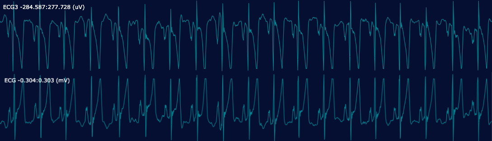

### Channel transducer/unit fields

```
destrat tmp/headers.db +HEADERS -r CH -v TRANS PDIM   | cut -f2- | sort | uniq -c | sort -nr
```

```
1006 SpO2	%	.
1003 DHR	bpm	.
735 Snore	mV	.
734 EtCO2	mmHg	.
711 Airflow	mV	.
710 ECG1	mV	.
696 RChin	mV	.
696 LChin	mV	.
684 CChin	mV	.
656 RLeg	mV	.
656 LLeg	mV	.
611 Cap	mmHg	.
571 Pleth	V	.
564 Chest	mV	.
539 CannulaFlow	mV	.
526 ABD	mV	.
493 O1	mV	.
493 M2	mV	.
493 M1	mV	.
493 F4	mV	.
493 E2	mV	.
493 E1	mV	.
493 C4	mV	.
493 C3	mV	.
492 O2	mV	.
492 F3	mV	.
487 ECG3	mV	.
479 ECG2	mV	.
451 O2_M1	mV	.
451 F4_M1	mV	.
451 E1_M2	mV	.
451 C4_M1	mV	.
447 O1_M2	mV	.
447 F3_M2	mV	.
447 C3_M2	mV	.
387 E2_M2	mV	.
```
### Position
We now shift our focus to the "Position" channel.
Out of the 1010 individuals, approximately 200 individuals have position channels associated with them.
```
luna sl/s0.lst silent=T -s 'CONTAINS sig=Position' | grep "PRESENT" > tmp/position.txt
```
```
cat tmp/position.txt | awk '$6 == 1 {print $1}' > tmp/position1.txt
```
```
cat sl/s0.lst | grep -f tmp/position1.txt > sl/position.lst
```
```
head sl/position.lst

pats-800105-baseline	nsrr_transfer/pats-800105-baseline.edf	nsrr_transfer/pats-800105-baseline.xml
pats-800295-baseline	nsrr_transfer/pats-800295-baseline.edf	nsrr_transfer/pats-800295-baseline.xml
pats-800444-baseline	nsrr_transfer/pats-800444-baseline.edf	nsrr_transfer/pats-800444-baseline.xml
pats-800444-followup	nsrr_transfer/pats-800444-followup.edf	nsrr_transfer/pats-800444-followup.xml
```
```
wc -l sl/position.lst
221
```
The Position channel has an encoding with float values. For example, from the 2nd study:<br>
<br>
Input from `Jean L. Arnold, RPSGT (Polysomnographic Research Tech, Division of Sleep and Circadian Disorders)`:<br>
Postion sensors were not calibrated for PATS.
Even though we are seeing values for that channel, we did not ask sites to go through the calibration process and to 
check that the sensor was accurately recording each position. Typically, they would need to hold the position sensor in all 
the positions (upright, supine, prone, left and right) and make sure that the equipment was recording position accurately.  
Since we did not have them perform this step, that data is unable to be used.

For PATS `Position` was optional and if the site did have position channel in the EDF we did not use it. 
Position was taken from the Electronic tech notes and the OBS form. I only enter time Supine from the notes in 
Profusion and all other positions were left as the default position Right since the SAS report only has variables 
for time on Back [Supine} and Other [all other positions]. If there is a position channel in the EDF we do not have 
any information about the positions since the sensor was not calibrated for PATS.
```
luna sl/s0.lst 2 -s TABULATE sig=Position
```
```
pats-800295-baseline	TABULATE	CH/Position;VALUE/-2.32547	.	N	3
pats-800295-baseline	TABULATE	CH/Position;VALUE/-2.10575	.	N	1
pats-800295-baseline	TABULATE	CH/Position;VALUE/-0.89723	.	N	3
pats-800295-baseline	TABULATE	CH/Position;VALUE/-0.714122	.	N	1
pats-800295-baseline	TABULATE	CH/Position;VALUE/-0.238041	.	N	119
pats-800295-baseline	TABULATE	CH/Position;VALUE/-0.164797	.	N	857
pats-800295-baseline	TABULATE	CH/Position;VALUE/-0.0915541	.	N	2889
```

## 5) Annotation review

###### Creating .annot file
We will also extract the sleep and respiratory annotations from xml files and write it to annot folder.
```
mkdir annots

luna sl/s0.lst fix-edf=T -s 'WRITE-ANNOTS file=annots/^.annot hms'
```
Here are some of the most common events (in `tmp/events.counts`):
```
cut -f1 annots/*.annot | sort | uniq -c | sort -nr > tmp/events.counts
```
```
414421 N2
278080 N3
275120 W
160601 R
105512 SpO2_desaturation
69681 N1
46045 Arousal_ASDA
43842 Limb_Movement_Right
42959 Limb_Movement_Left
22812 PLM_Left
22716 PLM_Right
20091 EtCO2_artifact
16424 SpO2_artifact
15217 Hypopnea
13737 Arousal
10132 Periodic_Breathing
6786 Obstructive_Apnea
4443 Central_Apnea
489 Unsure
```
Here `Unsure` will be mapped to `Mixed_Apnea`.

We can now build a new sample list that links the original EDFs with `.annot` files

```
luna --build nsrr_transfer/ annots/ -ext=.annot > sl/s1.lst
```
```
head sl/s1.lst
```
```
pats-800003-baseline	nsrr_transfer/pats-800003-baseline.edf	annots/pats-800003-baseline.annot
pats-800022-baseline	nsrr_transfer/pats-800022-baseline.edf	annots/pats-800022-baseline.annot
pats-800022-followup	nsrr_transfer/pats-800022-followup.edf	annots/pats-800022-followup.annot
```
Annotation files <a
href="https://zzz.bwh.harvard.edu/luna/ref/annotations/#luna-annotations"
target="_blank">(.annot) </a> are generated from the original XML
files. The event `Periodic Breathing` has been removed. The event
labeled as `Unsure` is, in PATS, mapped to `Mixed_Apnea`.

Here are some of the most common events and their mappings:

| Original label       | Harmonized _class_ label | Harmonized _instance_ label |
|----------------------|------------------|---------------------|
| N1                   | N1               | .                   |
| N2                   | N2               | .                   |
| N3                   | N3               | .                   |
| W                    | W                | .                   |
| R                    | R                | .                   |
| EtCO2_artifact       | artifact         | EtCO2               |
| SpO2_artifact        | artifact         | SpO2                |
| SpO2_desaturation    | desat            | .                   |
| Arousal              | arousal          | .                   |
| Arousal_ASDA         | arousal          | .                   |
| Limb_Movement_Right  | LM               | right               |
| Limb_Movement_Left   | LM               | left                |
| PLM_Right            | PLM              | right               |
| PLM_Left             | PLM              | left                |
| Hypopnea             | hypopnea         | .                   |
| Obstructive_Apnea    | apnea            | obstructive         |
| Central_Apnea        | apnea            | central             |
| Unsure               | apnea            | mixed               |

## 6) Manual staging

#### STAGE

Luna's `STAGE` command reports sleep stage information (e.g. as encoded stages in an annotation file. Internally, it creates a single annotation class called SleepStage, with instances that correspond to W, N1, N2, N3, R, ? and L (L
Here we run the jobs locally:

```
luna sl/s1.lst -o tmp/stage.db -s STAGE
```

When these jobs are complete, we can extract all stage information into a single file:

```
destrat tmp/stage.db +STAGE -r E > res/stage.info
```
```
head res/stage.info
```
```
ID	E	CLOCK_TIME	MINS	OSTAGE	STAGE	STAGE_N	START_SEC
pats-800003-baseline	1	21:53:45	0	W	W	1	0
pats-800003-baseline	2	21:54:15	0.5	W	W	1	30.0
pats-800003-baseline	3	21:54:45	1	W	W	1	60.0
pats-800003-baseline	4	21:55:15	1.5	W	W	1	90
pats-800003-baseline	5	21:55:45	2	W	W	1	120.0
pats-800003-baseline	6	21:56:15	2.5	W	W	1	150
pats-800003-baseline	7	21:56:45	3	W	W	1	180
pats-800003-baseline	8	21:57:15	3.5	W	W	1	210
pats-800003-baseline	9	21:57:45	4	W	W	1	240.0
```
There are no conflicts in the assigned staging, we do not see a `CONFLICT` column present.

Next we check that EDFs have staging annotations that span almost all
of the recording, with the `SPANNING` command:

```
luna sl/s1.lst -o tmp/spanning.db -s SPANNING annot=W,R,N1,N2,N3
```

None of the EDFs have more than 1% of the recording not spanned by one of the
above sleep stages: (i.e. the command below returns nothing)

```
destrat tmp/spanning.db +SPANNING -v SPANNED_PCT  | awk ' $2 < 0.99 '
```
We'll also check that all studies have at least some sleep stages set (i.e. versus wake), with
the `HYPNO` command:

```
luna sl/s1.lst -o tmp/hypno.db -s HYPNO
```
One individual has less than one hour of recorded sleep
```
destrat tmp/hypno.db +HYPNO -v TST | awk ' $2 < 60 ' > tmp/exclude.ids
```
```
pats-801257-baseline	32
```
Finally, we'll check that all individuals have multiple sleep stages assigned (i.e. versus
only wake/sleep staging). From the output of the previous `HYPNO` command:

```
destrat tmp/hypno.db +HYPNO -r SS/N1,N2,N3,R -v MINS | head
```
```
ID	SS	MINS
pats-800003-baseline	N1	24.5
pats-800003-baseline	N2	270.5
pats-800003-baseline	N3	112
pats-800003-baseline	R	87.5
pats-800022-baseline	N1	20
pats-800022-baseline	N2	222
pats-800022-baseline	N3	131
pats-800022-baseline	R	95.5
pats-800022-followup	N1	40
```
Summarizing the number of distinct non-zero stages per person.
```
destrat tmp/hypno.db +HYPNO -r SS/N1,N2,N3,R -v MINS | awk ' $3 > 0 { print $1 } ' | sort | uniq -c | awk ' { print $1 } ' | sort | uniq -c
```
```
9 3
1000 4
```
That is, most people are assigned some extent of 4 different sleep stage labels (from N1, N2, N3 and R).

# 7) Encodings

Prior to running NAP, here we check some of the basic ranges of
signals, for both continuous and discrete signals.

### Signal distributions

Here we get basic signal statistics on all channels: to avoid periods
of high artifact, e.g. at the start/end of recordings, here we will restrict
to epochs scored as sleep only:
In `cmd/stats.txt`:

```
MASK all
MASK unmask-ifnot=N1,N2,N3,R
STATS
```

Using `runner2.sh` to submit this job to the ERISone cluster (w/ 40-fold parallelism)

```
rm tmp/stats.batch*
/data/nsrr/bin/runner2.sh 15 sl/s1.lst . cmd/stats.txt o tmp/stats
```

Compiling outputs:

```
destrat tmp/stats.batch*db +STATS -r CH > res/ch.stats
```

The file `res/ch.stats` can be reviewed briefly; however, in this
report we will not describe this step here. Rather, we describe the
evaluation of the distribution (i.e. post-NAP) dataset more fully,
below.

### Duplicate/empty channels

The `DUPES` commands scans for duplicate (or flat channels - multiple flat/empty channels
will of course also be flagged as duplicates):
The file `cmd/dupes.txt` just contains the command `DUPES`

```
/data/nsrr/bin/runner2.sh 15 sl/s1.lst . cmd/dupes.txt o tmp/dupes
```

Checking that everything ran w/out error:

```
grep error tmp/dupes.batch000*err
```

we can then enumerate the recordings w/ duplicates and/or flat channels:

```
destrat tmp/dupes.batch*db +DUPES | cut -f2- | sort | uniq -c
```
```
DUPES FLAT INVALID

768 0	0	NA
26 0	1	0
1 0	2	0
176 1	0	0
2 1	1	0
2 1	2	0
1 2	0	0
1 2	1	0
2 2	2	0
7 3	0	0
1 3	3	0
```
The `INVALID` flag is set to 1 (not the case here) if either digital
or physical min/max values are identical in the EDF header, i.e. which
also implies a flat/undefined signal). `FLAT` implies that all
observed value are constant; `DUPES` indicate the number of channels
that are duplicated in the EDF (including if multiple flat channels).

Seven individuals appears to have flat channels:

```
destrat tmp/dupes.batch*db +DUPES | awk ' $2 == 0 && $3 == 1 '
```
```
pats-801369-baseline	0	1	0
pats-801720-baseline	0	1	0
pats-802062-baseline	0	1	0
pats-802420-baseline	0	1	0
pats-802767-baseline	0	1	0
pats-802834-baseline	0	1	0
pats-804056-baseline	0	1	0
pats-805316-baseline	0	1	0
pats-805608-baseline	0	1	0
```
Let's find the flat channel

```
allThreads=(01 02 03 04 05 06 07 08 09 10 11 12 13 14 15)
for t in ${allThreads[@]}; do destrat tmp/dupes.batch000${t}.db +DUPES -r CH; done > tmp/flat.channels
```
Frequency of Duplicate channels
```
cat tmp/flat.channels | awk '$3 == 1 {print $2}' | sort | uniq -c

159 EtCO2
130 TCO2
```
Frequency of Flat channels
```
cat tmp/flat.channels | awk '$4 == 1 {print $2}' | sort | uniq -c

1 CPres
1 EtCO2_Neo
2 Intercostal
2 INT_SAO2
5 LEAK
7 PAPPress
1 Position
2 PR
3 PRES
1 PTT
9 SPO2__2
5 TCO2
3 TVOL
```

#### Extract lights off and lights on time
The CSV file `pats-public-id-demo-20240211-with-lights.csv` includes timestamped entries indicating when the lights were turned on and off.<br>
Below is the Python script to extract and summarize this information for all individuals.
```python
import pandas as pd
fname = 'files/pats-public-id-demo-20240211-with-lights.csv'
df = pd.read_csv(fname)
selected_columns = df[['edf_name', 'STLOUTP', 'STLONP']]
selected_columns['edf_name'] = selected_columns['edf_name'].str.replace('.edf', '')
selected_columns.rename(columns={'edf_name': 'ID', 'STLOUTP': 'LIGHTS_OFF', 'STLONP': 'LIGHTS_ON'}, inplace=True)
output_file_path = 'files/lights.txt'
selected_columns.to_csv(output_file_path, sep='\t', index=False)
```
## 8) Quality control
We have encountered a recurring issue with the consistency of channel naming conventions.<br>
Specifically, there are multiple instances where what appears to be the same channel is listed under different names,<br> 
often differentiated only by case sensitivity or the addition of underscores and suffixes.
For example:
```python
Oxygen Saturation appears as: [SpO2, SpO2x, SPO2__2, SpO2xx, SPO2]
Airflow measurements include: [Airflow, AirFlow, AirflowXX, Airflowx, Airflow_x, Airflow2]
Carbon Dioxide levels are listed as: [EtCO2, ETCO2, EtCO2_2, NK_EtCO2, EtCO2___NK, EtCO2_XT, EtCO2_Neo, NK_EtCO2_Wave, EtCO2__NK]
```
To address this, We have plotted all channel values on a scatter plot to help us visually identify discrepancies and determine which channels might be duplicates or mislabeled (potentially "garbage channels"). This visual aid should facilitate decision-making regarding which channels are critical for our analysis and which might be discarded.

- Based on the plotted data, Do any of these channels seem redundant or incorrectly labeled?
- Are there specific channels that we suspect might not represent real data points?

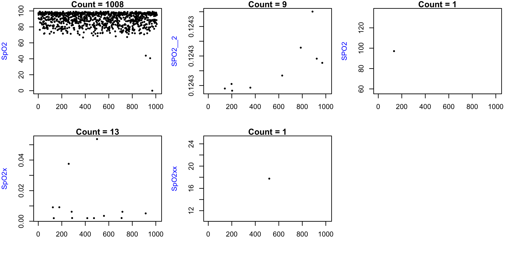
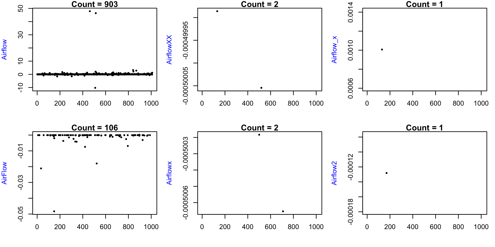
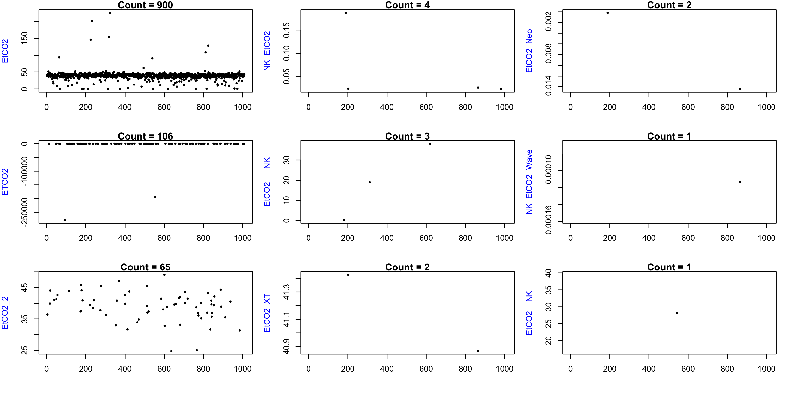

This visualization aids in deciding which channels are essential for analysis and which may be discarded. Upon review, the valid signals selected for further analysis were `SpO2`, `SPO2`, `Airflow`, `AirFlow`, `EtCO2`, and `EtCO2_2`, indicating these were considered the most reliable and consistent labels among the variants.

## 9) Interim report

In the pre-processing steps above, we have validated and summarized
the contents of all EDFs, and reformatted all annotation data (excluding
rare technician notes). 

Overall:

| Statistic                                | Value |
| ---------------------------------------- | ----- |
| Number of original recordings            | 1010  |
| Number of recordings w/ an issue flagged | 1     |

# 10) Running NAP

We now can run NAP to produce harmonized EDFs and annotation files.
NAP can perform some of the checks/reports done previously, but it is always
useful to have clearer sense of the nuances of the data by looking
at these things first (versus running NAP as a black box).

We first run on one test subject, then run on the cluster across all
subjects. When running NAP, it will expect the input to be `s.lst`
and it will generate an output folder called `nap/`. We'll copy the
final sample list from `sl/` to the root directory and name it
`s.lst`.

```
cp sl/derived.lst s.lst
```

To test NAP on an individual EDF (e.g. here, the first), e.g. run on
an interactive node:

First load the R package

```
module load R/3.6.3
```

Then run NAP pipeline on the first subject `pats-800003-baseline`

```
NAP_EXE_DIR=/data/purcell/src/luna-base \
NAP_SIGS=/data/nsrr/working/pats/pats.sigs \
NAP_RESOURCE_DIR=~/nsrr/common/resources/ \
NAP_R=/apps/source/R/3.6.3/lib64/R/bin/Rscript \
NAP_R_LIB=~/R/x86_64-pc-linux-gnu-library/3.6 \
 NAP_ONLY_HARM=1 \
 NAP_DO_MTM=0 \
 NAP_DO_PSD=0 \
 NAP_DO_POPS=0 \
 NAP_DO_SOAP=0 \
 NAP_DO_CODA1=0 \
 sh ~/nsrr/nap/nap.sh run1 . 1,1
```

The key option is `NAP_RESOURCE_DIR` which should always be set
explicitly (pointing to the NSRR repo). Use other options as needed
(see `nsrr/nap/default.conf` and NAP documentation for details).

Running on all individuals with `NAP_JOBN` level of parallelism on the
ERISone cluster (here turning off unnecessary options, other than
making the harmonized EDFs and annotations). Note: depending on the
exact compute environment (e.g. which cluster and queue, whether using
a private set of nodes, etc) one may need to alter parameters such as
`NAP_LSF_NODES`.

```
NAP_EXE_DIR=/data/purcell/src/luna-base \
 NAP_SIGS=/data/nsrr/working/pats/pats.sigs \
 NAP_RESOURCE_DIR=~/nsrr/common/resources/ \
 NAP_R=/apps/source/R/3.6.3/lib64/R/bin/Rscript \
 NAP_R_LIB=~/R/x86_64-pc-linux-gnu-library/3.6 \
 NAP_ONLY_HARM=1 \
 NAP_DO_MTM=0 \
 NAP_DO_PSD=0 \
 NAP_DO_POPS=0 \
 NAP_DO_SOAP=0 \
 NAP_DO_CODA1=0 \
 NAP_JOBN=15 \
 NAP_LSF_NODES="" \
 sh ~/nsrr/nap/nap.sh run1 .
```
To check NAP status for each individual, look at `nap.status`, `nap.log` and `nap.err` in `nap/*/`, e.g.:

```
cat nap/*/nap.status
```
NAP pipeline run was succesfull for all the subjects except the below three.
```
cat nap/*/nap.status | awk ' $2==0 {print $1}'

pats-811152-baseline
pats-813449-baseline
pats-813652-baseline
```
`pats-813652-baseline` individual EDF file is corrupt.<br>
`pats-813449-baseline` had tab issues in the `.annot` file. Manually fixed the tab issue.<br>
`pats-811152-baseline` individual had bad overlapping sleep stages.
In the start and stop time columns, milliseconds were overlapping. 
Let's get rid of milliseconds
```python
import pandas as pd

filename = 'annots/pats-811152-baseline.annot'

df  = pd.read_csv(filename, sep="\t", encoding="utf-8")

df['start'] = df['start'].str.split('.').str[0]
df['stop'] = df['stop'].str.split('.').str[0]

df.to_csv("annots/pats-811152-baseline.annot", sep="\t", index=False)
```
Now, re-run the NAP pipeline for `pats-811152-baseline` and `pats-813449-baseline`
NAP pipeline rub was succesfull for these two individuals.

## 11) Compiling the distribution dataset

Here we create the final distribution folder `dist/` containing
one harmonized EDF and one `.annot` file per individual.

```
mkdir dist
for id in `cat tmp/ids`
do
 cp -arvf nap/$id/data/$id.edf dist/
 cp -arvf nap/$id/annots/$id.annot dist/
done
```

to give a final of 1009 EDFs/annotation pairs. We'll perform a few
sanity checks on the distribution dataset, first making a new sample
list `d.lst`:

```
luna --build dist > sl/d.lst
```

First, we will check all the headers:

```
luna sl/d.lst -o tmp/headers2.db -s HEADERS signals
```

```
destrat tmp/headers2.db +HEADERS -v SIGNALS | cut -f2 | sort | uniq -c | sort -nr
```

<pre>
155 ECG,airflow,SpO2,pleth,EtCO2,cap,C3_M2,C4_M1,C3_LM,C4_LM,F3_M2,F4_M1,F3_LM,F4_LM,O1_M2,O2_M1,O1_LM,O2_LM,LOC,ROC,EMG,abdomen,thorax,thermistor,nasal_pres,HR,LAT,RAT,RAT.2,sound
142 C3_M2,C4_M1,F3_M2,F4_M1,O1_M2,O2_M1,ECG,airflow,EtCO2,SpO2,pleth,cap,LOC,ROC,EMG,abdomen,thorax,thermistor,nasal_pres,HR,LAT,RAT,LAT.2,RAT.2,TcCO2,sound
103 ECG,airflow,sum,SpO2,pleth,EtCO2,cap,C3_M2,C4_M1,C3_LM,C4_LM,F3_M2,F4_M1,F3_LM,F4_LM,O1_M2,O2_M1,O1_LM,O2_LM,LOC,ROC,EMG,abdomen,thorax,thermistor,HR,LAT,RAT,LAT.2,RAT.2,sound
102 C3_M2,C4_M1,O1_M2,O2_M1,F3_M2,F4_M1,ECG,airflow,sum,SpO2,pleth,EtCO2,cap,TcCO2,LOC,ROC,EMG,abdomen,thorax,thermistor,nasal_pres,HR,LAT,RAT,LAT.2,RAT.2,pos,sound
91 ECG,airflow,SpO2,pulse,pleth,cap,EtCO2,sum,C3_M2,C4_M1,C3_LM,C4_LM,F3_M2,F4_M1,F3_LM,F4_LM,O1_M2,O2_M1,O1_LM,O2_LM,LOC,ROC,EMG,abdomen,thorax,thermistor,HR,LAT,RAT,LAT.2,RAT.2,pos,sound
65 ECG,airflow,sum,SpO2,pleth,cap,EtCO2,TcCO2,C3_M2,C4_M1,C3_LM,C4_LM,F3_M2,F4_M1,F3_LM,F4_LM,O1_M2,O2_M1,O1_LM,O2_LM,LOC,ROC,EMG,abdomen,thorax,thermistor,nasal_pres,HR,LAT,RAT,RAT.2,pos,sound
60 F3_M2,C3_M2,O1_M2,F4_M1,C4_M1,O2_M1,ECG,airflow,SpO2,pleth,EtCO2,cap,LOC,ROC,abdomen,thorax,thermistor,nasal_pres,HR,LAT,RAT,LAT.2,RAT.2,TcCO2,sound
58 C3_M2,C4_M1,F3_M2,F4_M1,O1_M2,O2_M1,ECG,airflow,EtCO2,SpO2,pleth,cap,LOC,ROC,EMG,abdomen,thorax,thermistor,nasal_pres,HR,LAT,RAT,LAT.2,RAT.2,sound
36 C3_M2,C4_M1,O1_M2,O2_M1,F3_M2,F4_M1,ECG,airflow,SpO2,pleth,EtCO2,cap,LOC,ROC,EMG,abdomen,thorax,thermistor,nasal_pres,HR,LAT,RAT,LAT.2,RAT.2,TcCO2,sound
34 ECG,airflow,HR,SpO2,cap,EtCO2,pleth,sum,C3_M2,C4_M1,C3_LM,C4_LM,F3_M2,F4_M1,F3_LM,F4_LM,O1_M2,O2_M1,O1_LM,O2_LM,LOC,ROC,EMG,abdomen,thorax,thermistor,LAT,RAT,RAT.2,pos,sound
27 ECG,airflow,SpO2,pleth,EtCO2,cap,C3_M2,C4_M1,C3_LM,C4_LM,F3_M2,F4_M1,F3_LM,F4_LM,O1_M2,O2_M1,O1_LM,O2_LM,LOC,ROC,EMG,abdomen,thorax,thermistor,nasal_pres,HR,LAT,RAT,RAT.2,pos,sound
13 ECG,airflow,sound,SpO2,pulse,pleth,cap,EtCO2,sum,C3_M2,C4_M1,C3_LM,C4_LM,F3_M2,F4_M1,F3_LM,F4_LM,O1_M2,O2_M1,O1_LM,O2_LM,LOC,ROC,EMG,abdomen,thorax,thermistor,HR,LAT,RAT,LAT.2,RAT.2,TcCO2,pos
10 ECG,airflow,SpO2,pulse,pleth,cap,EtCO2,sum,C3_M2,C4_M1,C3_LM,C4_LM,F3_M2,F4_M1,F3_LM,F4_LM,O1_M2,O2_M1,O1_LM,O2_LM,LOC,ROC,EMG,abdomen,thorax,thermistor,HR,LAT,RAT,RAT.2,pos,sound
9 ECG,snore,airflow,SpO2,pulse,pleth,sum,TcCO2,EtCO2,cap,C3_M2,C4_M1,C3_LM,C4_LM,F3_M2,F4_M1,F3_LM,F4_LM,O1_M2,O2_M1,O1_LM,O2_LM,LOC,ROC,EMG,abdomen,thorax,thermistor,nasal_pres,HR,LAT,RAT,LAT.2,RAT.2,sound,cpap_flow
8 ECG,airflow,HR,SpO2,cap,EtCO2,pleth,sum,C3_M2,C4_M1,C3_LM,C4_LM,F3_M2,F4_M1,F3_LM,F4_LM,O1_M2,O2_M1,O1_LM,O2_LM,LOC,ROC,EMG,abdomen,thorax,thermistor,LAT,RAT,RAT.2,TcCO2,pos,sound
</pre>

### Compiling a summary statistic dataset

Next, we will generate a limited summary statistics: stage durations,
Hjorth statistics and/or means for all channels (for sleep data only),
and PSD for N2 sleep for the two central EEG channels.
We will exclude the handful of people with `a)` no EEGs:

```
destrat tmp/headers2.db +HEADERS -v SIGNALS | grep -v C3_M2 | awk ' NR != 1{ print $1 } ' > tmp/exclude.ids
```

Running the script `cmd/summstats.txt`, which is as follows:

<pre>
HYPNO 

RESAMPLE sig=C3_M2,C4_M1 sr=128	

TAG SCH/C3
SOAP sig=C3_M2 force-reload

TAG SCH/C4
SOAP sig=C4_M1 force-reload

TAG .

MASK all
MASK unmask-if=N1,N2,N3,R
RE

STATS sig=abdomen,C3_M2,C4_M1,F3_M2,F4_M1,O1_M2,O2_M1,EMG,LOC,ROC,thorax,thermistor,nasal_pres,HR,LAT,RAT,ECG
SIGSTATS sig=abdomen,C3_M2,C4_M1,F3_M2,F4_M1,O1_M2,O2_M1,EMG,LOC,ROC,thorax,thermistor,nasal_pres,HR,LAT,RAT,ECG

% N2 EEG power spectra only
MASK mask-ifnot=N2
RE

PSD sig=C3_M2,C4_M1 dB spectrum max=65
</pre>

Before running the cmd/summstats.txt we will ignore all EDF+D files since SOAP does not support it.
```
destrat tmp/headers2.db +HEADERS -v EDF_TYPE | grep EDF+D | awk '{print $1}' > tmp/exclude.EDF_D.ids
```
We will also add the previosuly excluded ids to this file
```
cat tmp/exclude.ids >> tmp/exclude.EDF_D.ids
```
```
wc -l tmp/exclude.EDF_D.ids
5
```
Running it first on a single subject.

```
luna sl/d.lst 1 exclude=tmp/exclude.EDF_D.ids -o tmp/summstats.db < cmd/summstats.txt
```

Running all subjects on the cluster:

```
/data/nsrr/bin/dev-runner2.sh 15 sl/d.lst . cmd/summstats.txt o tmp/summstats "exclude=tmp/exclude.EDF_D.ids"
```

After checking all jobs have successfully completed, we can compile the output:

```
destrat tmp/summstats.batch*db +HYPNO             > res/summ.hypno1
destrat tmp/summstats.batch*db +HYPNO -r SS       > res/summ.hypno2
destrat tmp/summstats.batch*db +STATS -r CH       > res/summ.stats
destrat tmp/summstats.batch*db +SOAP  -r SCH      > res/summ.soap
destrat tmp/summstats.batch*db +PSD   -r CH F     > res/summ.psd
destrat tmp/summstats.batch*db +SIGSTATS  -r CH   > res/summ.hjorth
```
Read data in R:

```R
h1 <- read.table("res/summ.hypno1",header=T,stringsAsFactors=F)
h2 <- read.table("res/summ.hypno2",header=T,stringsAsFactors=F)
sp <- read.table("res/summ.soap",header=T,stringsAsFactors=F)
st <- read.table("res/summ.stats",header=T,stringsAsFactors=F)
hj <- read.table("res/summ.hjorth",header=T,stringsAsFactors=F)
pw <- read.table("res/summ.psd",header=T,stringsAsFactors=F)

library(data.table)
h2 <- setDF( dcast( setDT( h2 ) , ID ~ SS , value.var = names(h2)[-(1:2)] ) )
sp <- setDF( dcast( setDT( sp ) , ID ~ SCH , value.var = names(sp)[-(1:2)] ) )
st <- setDF( dcast( setDT( st ) , ID ~ CH , value.var = names(st)[-(1:2)] ) )
hj <- setDF( dcast( setDT( hj ) , ID ~ CH , value.var = names(hj)[-(1:2)] ) )
pw <- setDF( dcast( setDT( pw ) , ID ~ CH + F  , value.var = names(pw)[-(1:3)] ) )
```

Merge with demographics data:

```
d <- read.table("files/demo.txt",header=T,stringsAsFactors=F, sep='\t')

# merge
h1 <- merge(h1, d , by="ID" )
h2 <- merge(h2, d , by="ID" )
sp <- merge(sp, d , by="ID" )
hj <- merge(hj, d , by="ID" )
st <- merge(st, d , by="ID" )
pw <- merge(pw, d , by="ID" )
```

```
dim(h1);dim(h2);dim(sp);dim(st);dim(hj);dim(pw)
```

```
[1] 1004   61
[1] 1004  126
[1] 1002   35
[1] 1004  357
[1] 1004   53
[1] 1004  515
```

### Brief descriptive analysis

Note - this does **not** constitute a full, careful analysis of these
data - rather, this is only a cursory review intend to flag some of
the more obvious major discrepancies or catastrophic manglings of the
data that may have occurred (prior to and/or after deposition into
NSRR) - e.g. at the level of "all studies lack any REM epochs" or "one
site has flat (or wildly differently calibrated) pulse channels", etc.

#### Macro-architecture

Here we plot the sleep duration (`TST`) and total recording time (`TRT`) for each individual:

```
png(file="pats-summ-macro1.png", height=400, width=800, res=100 )
par(mfcol=c(1,2))
plot( h1$TST , pch=21 , ylab="TST (in Minutes)" , col = "black", cex = 0.6, bg="navy" )
plot( h1$TRT , pch=21 , ylab="TRT (in Minutes)" , col = "black", cex = 0.6, bg="navy" )
dev.off()
```

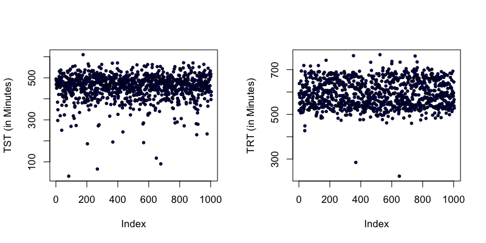

We next look at relative stage durations.

```
png(file="pats-summ-macro2.png", height=400, width=800, res=100 )
par(mfcol=c(1,4))
plot( h2$PCT_N1 , pch=21 , ylab="% N1", col = "black", cex = 0.6, bg="navy"  )
plot( h2$PCT_N2 , pch=21 , ylab="% N2", col = "black", cex = 0.6, bg="navy"  )
plot( h2$PCT_N3 , pch=21 , ylab="% N3", col = "black", cex = 0.6, bg="navy"  )
plot( h2$PCT_R  , pch=21 , ylab="% R", col = "black", cex = 0.6, bg="navy"  )
dev.off()
```

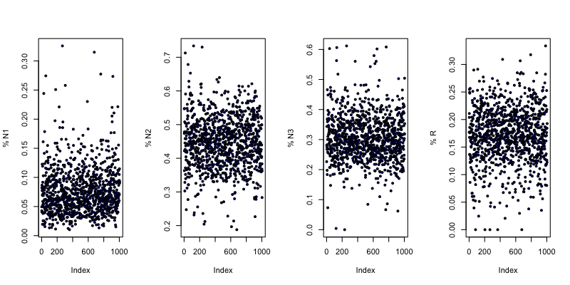

#### Signal means

Considering the mean value of each signal per individual.
(all from epochs scored as sleep to exclude periods of extreme artifact pre-/post-sleep):

```
# Get a list of channel labels (n=12)
chs <- gsub( "MEAN_","", names(st)[grep( "MEAN_" , names(st) ) ] )
png(file="pats-summ-means-ecg.png", height=600, width=1000, res=100 )
par(mfcol=c(6,3) , mar=c(1,4,1,1) )
for (ch  in chs )
  plot( st[,paste("MEAN",ch,sep="_")], pch=20, cex=0.6 , ylab=ch)
dev.off()
```

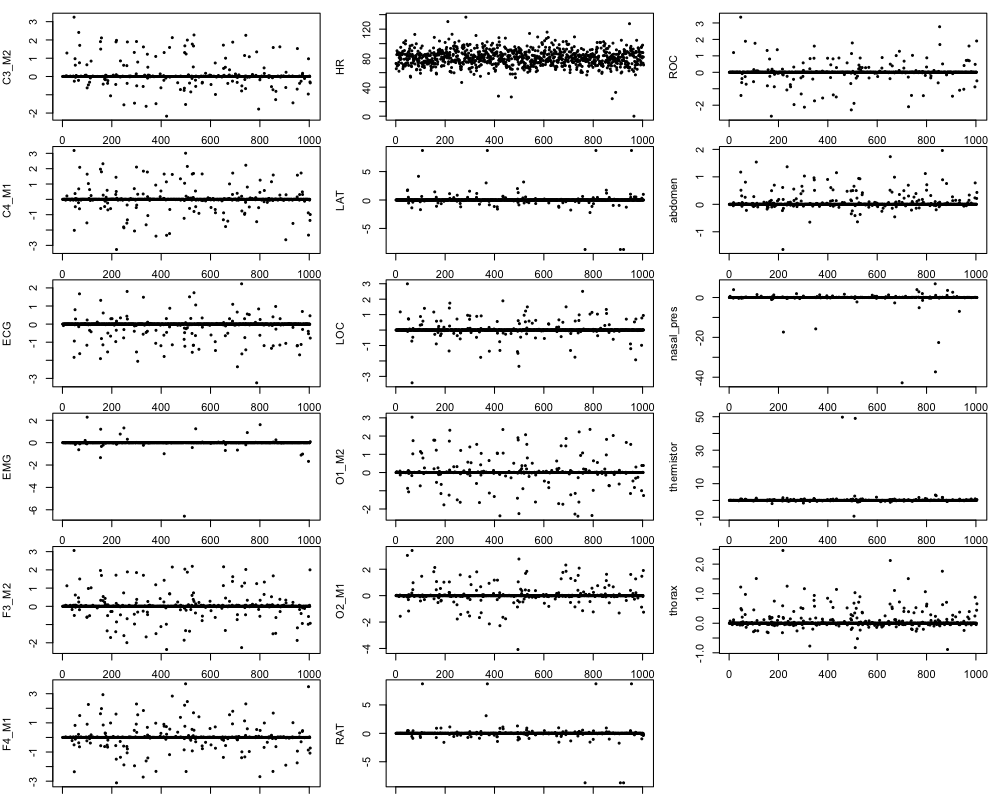

Here we see a few things worth noting:


Repeating, but removing outliers and adding 95% bounds, and now dropping the color-coding by study site by instead
showing mean, lower and upper bounds as black, blue and red repsectively:

```R
library(luna)
png(file="pats-summ-means2-ecg.png", height=600, width=1000, res=100 )
par(mfcol=c(6,3) , mar=c(1,4,1,1) )
for (ch  in chs ) {
  mn <- outliers(st[,paste("MEAN",ch,sep="_")])
  p5 <- st[,paste("P05",ch,sep="_")]
  p95 <- st[,paste("P95",ch,sep="_")]
  p5 <- p5[ ! is.na( mn ) ]
  p95 <- p95[ ! is.na( mn ) ]
  mn <- mn[ ! is.na( mn ) ]
  ylim <- range( c(p5,p95) , na.rm=T )
  plot( mn , ylim = ylim ,col="black" , pch=20, cex=0.6 , ylab=ch)
  points( p5, pch=20, cex=0.6 , col="blue" )
  points( p95, pch=20, cex=0.6 , col="red" )
}
dev.off()
```

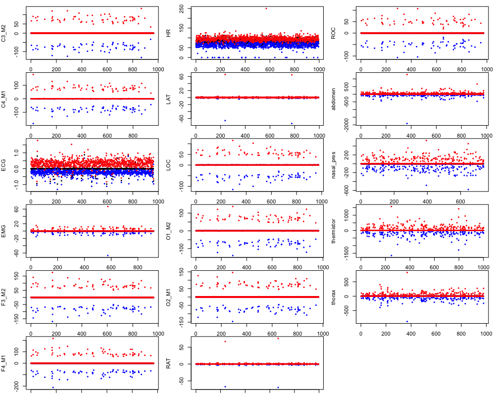

#### SOAP

We can use Luna's `SOAP` command to check the consistency of staging
and/or the quality of particular (EEG) signals that we expect to track
strongly with sleep stage. Here are the kappa values for each individual:

```
png(file="pats-summ-soap1.png", height=400, width=800, res=100 )
par(mfcol=c(1,2))
plot( sp$K3_C3 , pch=20 , ylab="SOAP kappa (C3-M2)" , xlab="Individual", col = "black", cex = 0.6, bg="navy"  )
plot( sp$K3_C4 , pch=20 , ylab="SOAP kappa (C4-M1)" , xlab="Individual", col = "black", cex = 0.6, bg="navy"  )
dev.off()
```

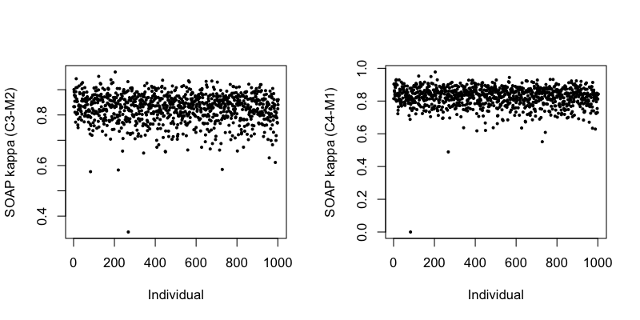

In `C3-M2` and `C4-M1` plot we see couple of individuals who's kappa3 score is less than 0.4

```R
library(data.table)
sp <- read.table("res/summ.soap",header=T,stringsAsFactors=F)
sp <- setDF( dcast( setDT( sp ) , ID ~ SCH , value.var = names(sp)[-(1:2)] ) )
d <- read.table("files/demo.txt",header=T,stringsAsFactors=F, sep='\t')
sp <- merge(sp, d , by="ID" )
sp2 <- sp[ sp$K3_C4 < 0.4, ]
sp2[,c("ID", "K3_C4")]
sp3 <- sp[ sp$K3_C3 < 0.4, ]
sp3[,c("ID", "K3_C3")]
```
```
    ID     K3_C4
pats-801257-baseline -3.47597e-13

    ID     K3_C3
pats-803827-baseline 0.3371648
```
Let's load `pats-801257-baseline` into Moonlight

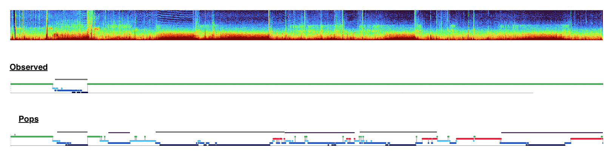

We see the observed stage bore no resemblance to the signal data.<br>
Let's run `POPS` automated staging. Now when we run `SOAP` against the `POPS` predicted stages<br>
we get a 	3-class Kappa score `0.81`. This confirms all signal and POPS stage annotations appear to be
correctly matched and aligned.

Let's load `pats-803827-baseline` into Moonlight

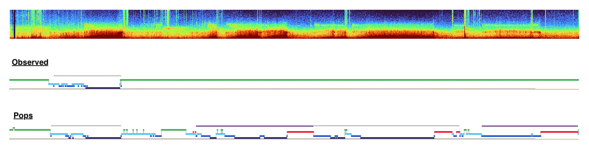

Here too, We see the observed stage bore no resemblance to the signal data.<br>
Let's run `POPS` automated staging. Now when we run `SOAP` against the `POPS` predicted stages<br>
we get a 	3-class Kappa score `0.89`. This confirms all signal and POPS stage annotations appear to be
correctly matched and aligned.

Looking at the PSG Report scorer comments, we find:
 
`pats-801257-baseline` - Site let Sleep Reading Center know about this severe study before sending it, split night starting CPAP by epoch 155, total sleep time only 35 min, continuous OA with deep desats [lowest sat 55%], PLMI=0, unable to measure 2 missed breaths due to continuous events, long events >30 sec real, Ineligible/Urgent Referral for AHI>30, OAI>20, and SpO2 <= 90% for over 2% of TST.
 
`pats-803827-baseline` - Site did split night due to severity of respi events, scored only the diagnostic portion of the study before CPAP started, only 66 minutes of sleep with no REM in this portion, lowest sat=84% with 10.6% of the SpO2 <=90%, OAI=20 and AHI=87.27. This would have been urgent referral for SpO2, AHI>30. Overall QA grade "other" due to total time in bed also to flag study was Split night with CPAP. LLeg had artifact, 2breaths=6sec.
 
So these were both exceptions to the standard PATS protocol (full night diagnostic PSG). Within an hour of the diagnostic PSG starting there were clear signs of sleep disordered breathing that would make the child ineligible for PATS, so the site took action to turn the study into a split-night. Our PSG scorer only scored the diagnostic portion (no point expending extra effort for a subject who isn't eligible).

#### N2 spectral power

Next, we calculate the power spectra for the two central EEG channels
during N2 sleep. We expect to see: a) that all studies have
approximately (order-of-magnitude) scaled spectra, b) that these
spectra follow a typical 1/f pattern c) whether any filtering has been
applied and if so, whether it is consistent across studies, and d)
potentially the presence of a peak in the sigma band reflecting
oscillatory spindle activity (although this can depend on the population).

Extracting the EEG power values for these channels:

```R
freq <- rep( seq( 0.5 , 64 , 0.25 ) ,2 )
fidx <- unique( freq )
vars.c3 <- names(pw)[2:256]
vars.c4 <- names(pw)[257:511]
ylim <- range( pw[,c(vars.c3,vars.c4)] )
fidx <- unique( freq )
ids <- unique( pw$ID )

png(file="pats-summ-psd1.png", height=600, width=1200, res=150 )
par(mfcol=c(1,2))
plot( fidx , fidx , type="n" , ylim = ylim , xlab="Frequency (Hz)", ylab="Power" , main="C3_M2" )
for (id in ids ) lines( fidx, as.numeric( pw[pw$ID == id,vars.c3] ) , col = rgb(0,100,100,25,max=255), lwd=1 )

plot( fidx , fidx , type="n" , ylim = ylim , xlab="Frequency (Hz)", ylab="Power" , main="C4_M1" )
for (id in ids ) lines( fidx, as.numeric( pw[pw$ID == id,vars.c4] ) , col = rgb(0,100,100,25,max=255), lwd=1 )
dev.off()
```


Focussing on the frequencies below 25 Hz:

```R
freq <- rep( seq( 0.5 , 64 , 0.25 ) ,2 )
fidx <- unique( freq )
vars.c3 <- names(pw)[2:100]
vars.c4 <- names(pw)[257:355]
ylim <- range( pw[,c(vars.c3,vars.c4)] )
fidx <- fidx[ fidx <= 25 ]
ids <- unique( pw$ID )

png(file="pats-summ-psd2.png", height=600, width=1200, res=150 )
par(mfcol=c(1,2))
plot( fidx , fidx , type="n" , ylim = ylim , xlab="Frequency (Hz)", ylab="Power" , main="C3_M2" )
for (id in ids ) lines( fidx, as.numeric( pw[pw$ID == id,vars.c3] ) , col = rgb(0,100,100,25,max=255), lwd=1 )

plot( fidx , fidx , type="n" , ylim = ylim , xlab="Frequency (Hz)", ylab="Power" , main="C4_M1" )
for (id in ids ) lines( fidx, as.numeric( pw[pw$ID == id,vars.c4] ) , col = rgb(0,100,100,25,max=255), lwd=1 )
dev.off()
```

[TBA]

## 12) Depositing an as is dataset

The harmonized distribution dataset (`dist/`) reflects a subset of the
full, original dataset (in terms of the number of channels, etc). We
also post the full, original dataset _as is_

We identified that a total of 261 files contained EDF Annotations that <br>
included Protected Health Information (PHI). Using the `luna force-edf=T` command, <br>
we have successfully removed all PHI annotations from the original files. This process converts the <br>
EDF+ files into standard EDF files, ensuring that they no longer contain any sensitive information.

```
luna sl/edfc.lst force-edf=T skip-edf-annots=T -s 'WRITE edf-dir=misc/'
cp -avf misc/* nsrr_transfer
```
## 13) Polarity checks

#### Cross-channel correlations
Calculate the correlation coefficient between C3 and C4 channels.<br>
Correlations are the Pearson's correlation coefficient, calculated epoch-by-epoch between the two time series,<br> 
then averaged over all epochs for a given individual. This will give you a measure of how similar the signals are between channels C3 and C4.
<br>
```
destrat tmp/polarity.batch00*.db +CORREL -r CH1 CH2 -v R > files/chan.corr
```
The distribution of the correlations is asymmetrical and seems to be skewed to the right, with a longer tail on the right side of the peak. <br>
The skewness of the distribution indicates that channels C3 and C4 are more often positively correlated than negatively.<br>
A positive correlation between EEG channels C3 and C4 can be attributed to several phenomena including<br>
1) Functional Connectivity<br>
2) Common Reference Artifact<br>
3) Volume Conduction<br>

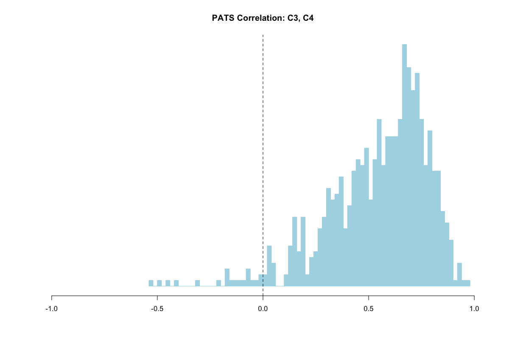

#### Spindle/SO coupling
The coupling of spindles and slow oscillations is a phase-amplitude coupling where the amplitude of spindle activity is modulated by the phase of the slow oscillation.<br>Spindles are most likely to occur during the `up-state` of slow oscillations, where neurons are more likely to fire.<br>
This coupling can be visualized and quantified in several ways, including the use of histograms to represent the phase relationship between spindles and slow<br> oscillations. These histograms often plot the phase of the slow oscillation (0-360 degrees) against the occurrence of spindle peaks. Deviations in<br> the expected phase relationships can prompt further investigation into potential issues with data collection or signal interpretation, such as EEG polarity flips.

Running it on one invidual:
```
luna sl/s1.lst 1 -o tmp/spindle.db sig=C3,C4,C3_M2,C4_M1 < cmd/spindle.txt
```
```
cat cmd/spindle.txt
```
```
MASK all
MASK unmask-if=N2
RESTRUCTURE
SPINDLES sig=${eeg} fc=15 so mag=1.5
```
Running all subjects on the cluster:
```
/data/nsrr/bin/dev-runner2.sh 15 sl/s1.lst . cmd/spindle.txt o tmp/spindles sig=C3,C4,C3_M2,C4_M1
```
Extract the measures:
```
destrat tmp/spindles.batch00*.db +SPINDLES -r F CH > files/sosp.coupling
```
The distribution is bimodal, with two distinct peaks.<br>
The highest peak occurs just before 180 degrees, indicating that the most common phase for spindle activity is in the descending phase of the slow oscillation.<br>There is a secondary, smaller peak around the 270-degree mark, which suggests a less common, but still notable, phase where some spindle activity is <br>coupled. The broad range of bars across the cycle indicates variability in coupling, meaning not all spindle activity is locked to the same SO phase.<br> 
This unusual distribution could indeed suggest a possible flip in EEG polarity. In EEG recordings, polarity flips can result from several factors, such as <br>incorrect electrode placement, issues with reference electrodes, or even the inversion of signal during processing. A flip in polarity would mean that the<br> positive and negative deflections in the EEG data are reversed, which could lead to the misinterpretation of the phase of slow oscillation in relation to the spindle activity.

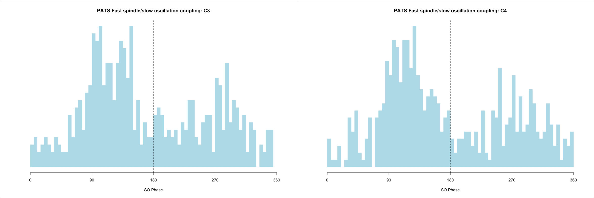

#### Single-channel polarity heuristic
For each individual next we look at semi-signal power spectra differences.
For detailed documentation visit [EEG Polarity](https://zzz.bwh.harvard.edu/luna/vignettes/nsrr-polarity/)
```
destrat tmp/polarity.batch00*.db +POL -r F CH > files/polarity.pats
```
The plots below show the difference in spectral power for the upper versus the lower semi-signal.<br>
Calculated across all N2, N3 epochs and all individuals super-imposed.<br>
In general we should see a characteristic downward dip around 2 Hz in these spectra difference plots, indicative of the more pronounced negative peaks<br> associated with slow oscillations. In contrast, for PATS we see that many individuals have a flipped C3, C4 channel.<br>
This confirms a flip in EEG polarity.

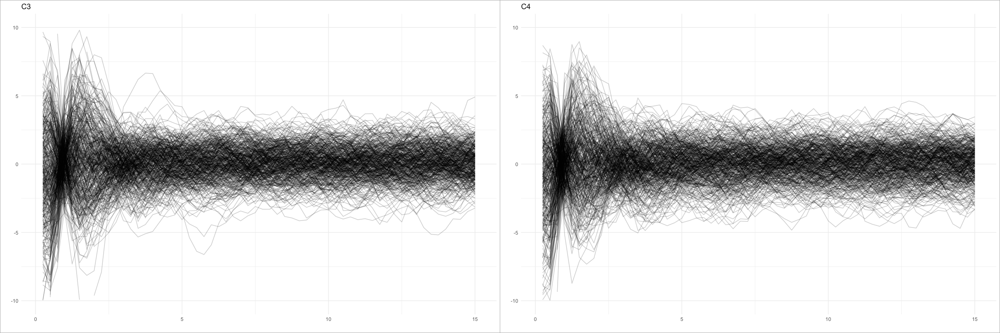

#### Polarity flip

We applied the threshold criteria `T_DIFF > 0 & COUPL_ANGLE < 200` to narrow down the list of individuals for flipping the central EEG channels.
```
head files/flip.dat 

ID	FLIP
pats-800003-baseline	C3,C4,C3_M2,C4_M1
pats-800135-baseline	C3,C4,C3_M2,C4_M1
pats-800194-baseline	C3,C4,C3_M2,C4_M1
pats-800227-baseline	C3,C4,C3_M2,C4_M1
pats-814491-followup	NA
pats-814493-baseline	NA
pats-814493-followup	NA
pats-814512-baseline	NA
pats-814512-followup	NA
```

Let's continue the spindle-so analysis this time flipping the signal. Running it on one invidual:
```
luna sl/s1.lst 1 vars=files/flip.dat -o signal_flip.db sig=C3,C4,C3_M2,C4_M1 < cmd/spindle.txt
```
```
cat cmd/spindle.txt
```
```
MASK all
MASK unmask-if=N2
RESTRUCTURE
FLIP sig=${FLIP}
SPINDLES sig=${eeg} fc=15 so mag=1.5
```
Running all subjects on the cluster:
```
/data/nsrr/bin/dev-runner2.sh 15 sl/s1.lst . cmd/spindle.txt o tmp/signal_flip "vars=files/flip.dat sig=C3,C4,C3_M2,C4_M1"
```
```
destrat tmp/spindles_flip.batch00*.db +SPINDLES -r F CH > files/sosp.coupling.flip
```
The distribution seems to be slightly right-skewed.<br>
Spindle activity is expected to be coupled with the ascending phase of the SO, near the 270-degree mark.<br>
The spindle/SO coupling now exhibits a clear clustering around the 270-degree mark.<br>
The correction of the channel polarity has indeed resolved the initial issue, <br>
allowing us to proceed with a more accurate analysis of the spindle and SO interactions.

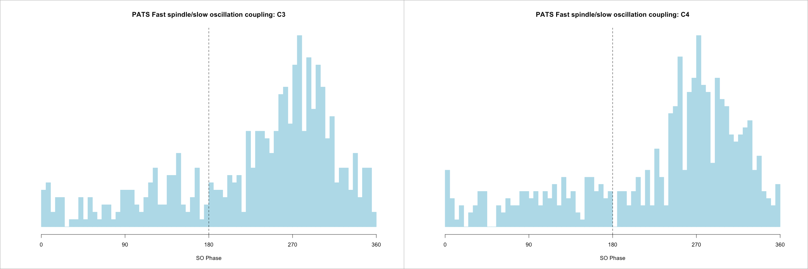

#### Flip Central EEG Channels 

We have identified a total of 289 individuals whose central EEG channels (C3,C4,C3_M2,C4_M1) need to be corrected by flipping.<br>
The process involves:
1) Identifying and flipping the central EEG channels for the affected 289 individuals.
2) Saving the new, corrected files in the appropriate format for NSRR distribution.

Running the `FLIP` command on one individual:
```
luna sl/flip.lst 1 < cmd/flip.txt
```
```
cat cmd/flip.txt
```
```
FLIP sig=C3,C4,C3_M2,C4_M1
WRITE edf-dir=/data/nsrr/working/pats/dist2
```
Running on all subjects:
```
luna sl/flip.lst < cmd/flip.txt
```
The corrected edf's, with the central channels properly oriented, have now been stored in a new directory named `f2`.
