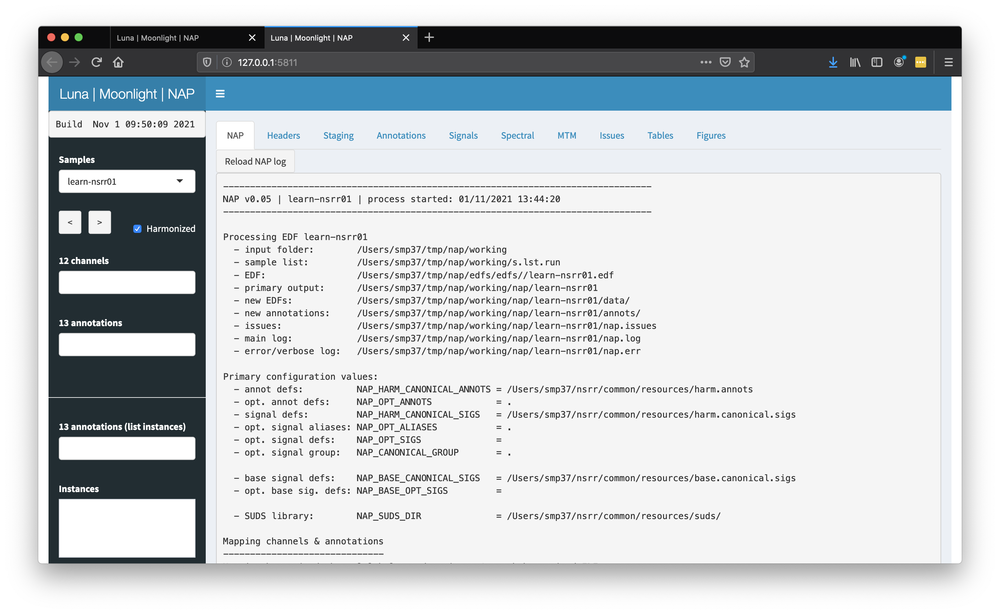

# NSRR resources & scripts

NSRR common and study-specific resources and scripts, including NAP. This repository has the following structure.

```
 nap/           NSRR Automated Pipeline components

 common/        Generic NSRR-wide information and resources;
   /resources/  NAP signal & annotation mapping files
   /dict/       NAP data-dictionaries

 studies/       Study-specific resources & core scripts
                - e.g. as used to reformat annotation data prior to NAP
                - also any study-specific configurations or mappings
                - each subfolder is a study
```

This document contains a detailed description of the NAP pipeline, including examples of how to run it.

For a higher-level overview of what the NSRR harmonization process is
attempting to achieve, please
see[common/harm-principles.md](common/harm-principles.md).


__Table of Contents__

- [NAP preliminaries](#nap-preliminaries)
- [Running NAP](#running-nap)
- [NAP primary steps](#nap-primary-steps)
   - [Harmonizing annotations and channels](#1-harmonizing-annotations-and-channels)	      
   - [Determining whether valid staging exists](#2-determining-whether-valid-staging-exists)	      
   - [Generating channel-level summary statistics](#3-generating-channel-level-summary-statistics)      
   - [Generating the harmonized EDFs](#4-generating-the-harmonized-edfs)		      
   - [Generating the base EDFs](#5-generating-the-base-edfs)			      
   - [Detecting/masking epochs with gross artifact](#6-detecting-epochs-with-gross-artifact)	      
   - [SOAP/SUDS](#7-soapsuds)					      
   - [Estimating a set of core derived metrics](#8-estimating-a-set-of-core-derived-metrics)	      
   - [Flagging likely issues](#9-flagging-likely-issues)			      
   - [Job completion](#10-job-completion)				      
   - [NAP signal mapping](#nap-signal-mapping)				      
   - [NAP annotation mapping](#nap-annotation-mapping)                
- [Annotation mapping formatting notes](#annotation-mapping-formatting-notes)
- [Adding cohort/individual-specific mappings](#adding-cohort-individual-specific-mappings)
- [Adding new commands/domains to NAP](#adding-new-commands-domains-to-nap)
- [NAP run status](#nap-run-status)
- [Moonlight NAP viewer](#moonlight-viewer)
- [Collating information across individuals](#collating-information-across-individuals)
- [Configuration scripts](#configuration-scripts)
- [Misc/future development](#misc-future-development)
- [Known issues/questions](#known-issuesquestions)
- [Example: running NAP on ERIS](#example-running-nap-on-eris)

- [Appendix: harmonization principles](common/harm-principles.md)
---

## NAP preliminaries

Inputs for NAP are signals (expected as an [EDF](https://www.edfplus.info)) and annotations, which can be in several formats:

 - NSRR or [Luna XML](http://zzz.bwh.harvard.edu/luna/ref/annotations/#nsrr-xml-files)
 - Luna [`.annot`](http://zzz.bwh.harvard.edu/luna/ref/annotations/#annot-files)
 - Luna [`.eannot`](http://zzz.bwh.harvard.edu/luna/ref/annotations/#eannot-files)
 - Embedded in an EDF+ as an [Annotation channel](http://zzz.bwh.harvard.edu/luna/luna/args/#annotations)

Annotation data in any other format must be be converted to one of the
above, preferably [`.annot`](http://zzz.bwh.harvard.edu/luna/ref/annotations/#annot-files)
before running NAP.

A further preliminary is that _body position_ information must stored
as an _annotation_ rather than as _signal_ in the EDF: because there are too many
non-standardized ways to encode body position as a signal, it is
outside the scope of NAP to automatically attempt to reserve-engineer this. See
notes below on harmonized annotation remappings for the preferred way to
encode body position as an annotation for NAP.

## Running NAP 

First ensure you have the most recent version of the NSRR/NAP repository
on your system: if not, [see below](#example-running-nap-on-eris).   Let's assume it is
in your home directory (e.g. `~/`).

Second, it is easiest if you have a working folder that has a Luna
[sample list](http://zzz.bwh.harvard.edu/luna/luna/args/#sample-lists)
called `s.lst`, that points to the data (EDFs and annotations) you
wish to process.  Let's assume this folder is located at `/data/working/project1`

We initiate the NAP pipeline via the `nap.sh` shell script, which is
in the repository, i.e.  `~/nsrr/nap/nap.sh` in this example.  The
basic form takes two or more options: first, a label for the run (here
_run1_); second, the path to the folder that contains the sample list (`s.lst`):

```
bash ~/nsrr/nap/nap.sh run1 /data/working/project1
```

Note that the actual EDFs/annotations do not need to also be in that same folder, i.e. the sample
list can point to other locations on the system.

By defauly, NAP will run and generate an output folder called `nap` in
the specified directory, i.e. `/data/working/project1/nap/`.

There are numerous configuration options that NAP takes, described in
the file [default.conf](https://gitlab-scm.partners.org/zzz-public/nsrr/-/blob/master/nap/default.conf)
(which is in the `nsrr/nap/` repository folder).

The most important is to specify the resources used by NAP (`NAP_RESOURCE_DIR`) and,
if automated staging is to be performed, the SUDS training data (`NAP_SUDS_DIR`) location: e.g.
you can prepend these environment variables for the `nap.sh` call as follows:

```
NAP_RESOURCE_DIR=nsrr/common/resources/ \
 NAP_SUDS_DIR=resources/suds/ \
 bash ~/nsrr/nap/nap.sh run1 /data/working/project1
```

The project name `run1` is arbitrary and not really used currently - still, ensure
that it does not contain spectial characters or whitespace. 

As described below, on ERIS, to send to the cluster, add `NAP_JOBN=10`
for get, for example, 10-fold parallelization. See other
`nsrr/nap/default.config` configuration parameters for other
LSF/ERIS-specific options.

On completion, check job status across runs, e.g.:
```
cat nap/*/nap.status
```


### Compiling results across individuals

For a whole cohort, to compile key results across runs, creating a
folder `derived1` (this can be named anything, and does not need to be
located in the working folder): 

```
cd /data/working/project1/
bash ~/nsrr/nap/compile.sh derived1 < ~nsrr/nap/tables.txt
```

i.e. you need to be in the main NAP project folder before running
this.

To convert the summary tables in `derived1/` to a format Luna/Shiny
can read, see `~/nsrr/nap/compile-coda-template.R`.  Edit and run as
needed to deposit `_pheno*RData` and `_derived*RData` files in `nap/`.


## NAP primary steps

Here we list the primary logic and flow of actions for a single EDF in NAP:

 - consistent with building a _generic_ pipeline (i.e. that is capable
   of processing most typical PSGs), we build a single set of common
   mapping files (whilst allowing for study-specific deviations)

 - we create a new set of harmonized annotations, and two new EDFs
   (_harmonized_ and _base_ EDFs)

 - rather than attempt to map everything, the logic is to have a
   list of common annotations/channels and construct as much as we can
   from the original data; that is, new files are harmonized
   _subsets_ of the originals

 - we nonetheless report unmapped/unused channels and annotations;
   (nb. this is why the original EDFs/annotations will always be
   distributed via NSRR too)


#### 1) Harmonizing annotations and channels

Following the rules described in sections below, NAP will first
generate the mapping for annotations and channels for the harmonized
(and base) EDF, as well as listing unmapped channels/annotations.

If the `NAP_HARMONIZE_ONLY` flag is set, NAP will stop at this point,
thereby providing a quick way to scan a whole cohort for adherence to
the NAP mapping terms.

#### 2) Determining whether valid staging exists

If continuing to process the sample, NAP next determines whether valid sleep stage annotations exist:

 - there must be at least one annotation file

 - those annotations must include terms that map to the canonical
   sleep stage terms, `N1`, `N2` etc

 - there must be sufficient _variability_ in sleep stages (i.e. not "all wake"), which
   is defined as at least two instances of wake, NREM and REM sleep


In addition, NAP will check here whether the sleep stage annotations
_align_ with the EDF epochs and EDF records.  For example, if staging
starts of 2.86 seconds from the start of the recording, this will be
flagged (i.e. as default epochs are 0-30, 30-60, etc, and so NAP will
see that 2.86-32.86, 32.86-62.86, etc) is likely to lead to epochs
that have more than one stage assigned.  This is handled downstream,
when creating the harmonized EDF by re-aligning the staging
annotations, by:

  - shifting them to the preceding second boundary (i.e. 2.00)

  - ensuring a 1-second EDF record standardized

  - trimming any signal not spanned by an epoch at the start or end of
    the recording (i.e. 0.00 to 2.00 in this case)

#### 3) Generating channel-level summary statistics

Based on the original EDF, NAP generates various statistical summaries
(e.g. MTM spectrograms and Hjorth parameters) that can be used in the
viewer to assess signal quality (epoch-by-epoch).

#### 4) Generating the harmonized EDFs

NAP next generates the _harmonized_ EDF:

 - the EDF record size is forced to be 1 second, if it is not already
 - as above, any unaligned sleep stages are shifted to align with EDF record boundaries (this will always be <1 second difference)
 - channel labels are harmonized, and unmapped channels are dropped
 - annotation labels are harmonized, and unmapped annotations are dropped
 - all annotations are output as a single `harm.annot` file

At this stage, note that the channel relabeling also enforces
__re-referencing__ of the EEG, EMG, ECG and EOG as needed.  i.e. we
define the harmonized files to consistently have `C4-M1`.

Although this deviates from the original conception as the harmonized
dataset as having only _cosmetic_ changes (in contrast to the base
EDF), in practice it is inconvenient to have to work with mixtures of
channels.  For PSG, the contralateral mastoid is the most standard EEG
reference.  (i.e. if users want something different, that is what the
original dataset is for...)

NOTE: a decision point is whether to include linked-mastoid referencing on top of contralateral mastoid
referencing in the harmonized EDFs.


#### 5) Generating the base EDFs

The base EDF represents a further subsetting _and processing_ of the
harmonized EDF; the base EDF is primarily to support subsequent
processing and extraction of _derived metrics_, rather than to be the
primary approach for distributing data.  (That is, the harmonized set should be
the natural level for data sharing.)

Specifically, to make the base EDF we:

   - reduce to a set of core channels, which specific labels (`csC3`)
     to denote these are processed versions of the original data;
     mapping is based on `nsrr/common/resources/base.canonical.sigs`

  - bandpass filter the EEG

  - resample to a fixed sample rate (e.g. 128 Hz for EEG)

  - scale to common units (e.g. uV for EEG, based on EDF headers)


TODO/DECISION POINT: whether to additionally remove epochs with gross
artifact from the base EDF (and adjust the annotations
correspondingly)

All subsequent analyses are based on the base EDF.


#### 6) Detecting epochs with gross artifact

Based on Hjorth parameters/RMS within signals, we flag epochs
(channel/epoch pairs) that are likely to be artifacts
(i.e. statistical outliers and grossly flat/clipped signals).

DECISION POINT: it may make sense to simply remove these epochs from
the base EDF, but we'd need to make sure we correctly handle the implied
changes in annotations (e.g. when lining up manual and automated staging, etc)

#### 7) SOAP/SUDS

If the study has existing and valid sleep stages, we apply the
[SOAP](http://zzz.bwh.harvard.edu/luna/ref/suds/#soap) method, for
the assessment of the consistency of staging and signals (based only
on a single EEG).

Further, whether there was existing staging or not, if an EEG channel
is present, we
apply[SUDS](http://zzz.bwh.harvard.edu/luna/ref/suds/#suds) to
automatically predict sleep stage.  If there was no prior staging,
then the predicted stages are used to structure the analyses below
(e.g. NREM spindles).

NOTE: this not yet fully integrated in NAP: propose to use CFS as the
default library.


#### 8) Estimating a set of core derived metrics

Depending on the availability of channels, we calculate (from the base EDF):

 - power spectra for the cleaned data, in NREM and REM separately
 - sleep spindles and slow oscillations during NREM
 - respiratory metrics

These outputs are compiled (by the `coda` R scripts in `nsrr/nap/`)
and can be seen in the Moonlight viewer.  The text output format is
also designed to work with the [`dmerge`](http://zzz.bwh.harvard.edu/luna/merge/merge/)
output tool, to make it easy to compile datasets across all individuals
(i.e. using `dmerge` and the data dictionaries in `nsrr/common/dict`).

#### 9) Flagging likely issues

For certain issues, we can flag rather than attempt to fix:

  - absence of staging data / poor coverage, i.e. truncated staging
  - (as above) gross artifact (EEG only, by epoch and channel)
  - flag potential EEG polarity issues (negative / ambiguous channels)
  - flag likely ECG contamination (e.g. EEG/ECH coherence)
  - flag likely line noise / EDFs with peaks in the <35 Hz range
  - flag is NREM spectral slope grossly deviant from ~2 (e.g < 1 or > 5)
  - flag if likely units issue in the EEG (i.e. large values or DC offset)
  - flag if low SOAP consistency

#### 10) Job completion

On closing, NAP will have populated `nap.log` and `nap.err` files that
can be viewed in the web viewer.

It will also create a file called `nap.status` that contains either a
`0` or `1`, as a flag for failure or success of the run.


### NAP signal mapping

NAP uses Luna's
[`CANONICAL`](http://zzz.bwh.harvard.edu/luna/ref/manipulations/#canonical)
command and implied rules to map channel labels (note, rather than the
[signal `alias` conventions](http://zzz.bwh.harvard.edu/luna/luna/args/#aliases)).
This allows for cohort-dependent rules to be applied, and for unmapped
channels to be automatically dropped, etc.

Notes:

 - matching on signal labels are _case-insensitive_ in NAP & Luna

 - canonical forms, where appropriate, use capitals: e.g. `SpO2`, `C3-M2`  

 - for consistency with prior EDF specs, will adopt `-` rather than
   `_` to indicate referencing


There are two levels of channel mapping:

 1. From the original EDF to a harmonized EDF, based on
 [`nsrr/common/resources/harm.canonical.sigs`](https://gitlab-scm.partners.org/zzz-public/nsrr/-/blob/master/common/resources/harm.canonical.sigs). At
 this step, NAP saves a small version (i.e. 1 epoch) of the EDF with
 the mapped labels, dropping any unmapped channels

 2. From the harmonized EDF to the base EDF, using the mappings in
 [`nsrr/common/resources/base.canonical.sigs`](https://gitlab-scm.partners.org/zzz-public/nsrr/-/blob/master/common/resources/base.canonical.sigs).
 

### NAP annotation mapping

NAP uses Luna's [`remap` syntax](http://zzz.bwh.harvard.edu/luna/luna/args/#remapping-annotations)
to map annotations from original to
harmonized datasets.  (Base datasets have identical annotations
compared to the harmonized set, so there is no second step for
annotations).

The primary mapping is specified in the file
[`nsrr/common/resources/harm.annots`](https://gitlab-scm.partners.org/zzz-public/nsrr/-/blob/master/common/resources/harm.annots).
The flow is as follows:

 - NAP first writes all annotations (from one or more annotation files
   associated with the EDF, and including any EDF+ Annotation Channels) to
   a single `a.annot` file (in the `annots/` NAP folder for
   that individual), but without any further changes.  This file simply collates all annotations to
   facilitate the subsequent mapping step.

 - NAP then maps the annotations to a new file `annots/harm.annot`,
   applying mapping rules as specified in the mapping file
   [`nsrr/common/resources/harm.annots`](https://gitlab-scm.partners.org/zzz-public/nsrr/-/blob/master/common/resources/harm.annots)

 - NAP tracks any remapping performed; and also lists any unmapped
   annotations. The latter are excluded from the new, harmonized
   `annots/harm.annot`.

If the `NAP_HARMONIZE_ONLY` configuration parameter is set to `1`, at
this point NAP will stop processing for this individual (i.e. only
having mapped channels and annotations).  This can be useful to
quickly scan a large number of EDFs for the adequacy of the
signal/annotation mapping files, prior to the final NAP run.


## Annotation mapping formatting notes

Annotation remapping uses a special form Luna's [class/instance
conventions](http://zzz.bwh.harvard.edu/luna/ref/annotations/#luna-annotations),
denoted by the `/` character:

```
remap   arousal|"Arousal ()"
remap   arousal|"Arousal|Arousal ()"
remap   arousal|"Arousal|Arousal (Standard)"

remap   arousal/spontaneous|"Spontaneous arousal|Arousal (apon aro)"
remap   arousal/spontaneous|"Spontaneous arousal|Arousal (ARO SPONT)"
remap   arousal/spontaneous|"Spontaneous arousal|Arousal (SPON ARO)"

remap   arousal/RERA|"Arousal resulting from respiratory effort|Arousal (ARO RES)"
remap   arousal/RERA|RERA
remap   arousal/RERA|"Arousal (ARO RES)"
remap   arousal/RERA|"Arousal resulting from respiratory effort|Arousal (RESP ARO)"
remap   arousal/RERA|"Respiratory effort related arousal|RERA"
```

That is, Luna's annotation format defines events by two IDs (as well as a corresponding time interval, and optionally channel labels(s)).
The above form `arousal/RERA` is equivalent to setting `arousal` as the annotation _class ID_, and `RERA` as the annotation _instance ID_.
For example, using applying this mapping, it would have been equivalent to an initial annotation file that used the following form:

```
class    instance    channel    start   stop    metadata
arousal  RERA        .          222.3   224.2   .
```

The use of class/instance labels in this way has several advantages:

 - it logically groups related sets of entities (e.g. different types of arousal)

 - it makes it easier to refer to the entire set, e.g. `MASK if=arousal`

 - it is still easy to pull out specific subsets, e.g. `MASK if=arousal[RERA]`

 - there is an option in Luna to simply concatenate labels back to a single term if needed (`arousal_RERA`)

 - any existing _instance ID_ information becomes part of the meta-data (`_inst=X`)

Annotation mapping is case insensitive, i.e.  above `rera` would still
map to `arousal/RERA`.  (Note, for downstream use in Luna, Luna still
treats labels as case-sensitive however.)

Below are some misc. notes on the annotation remapping process as it stands:

 - we've added two Luna special variables: `annot-whitelist=T` and `annot-unmapped=T` to only include
   annotations that match a remapping file, or don't, respectively.

 - the `SignalLocation` tag from NSRR XML is now parsed and included as the channel column in the `.annot`

 - meta-data from an NSRR XML (e.g. `SpO2Nadir`) are automatically added as string meta-data in the `.annot` file

 - `.annot` files now allow arbitrary key/value pairs, e.g.
   ```
   desat    .    .    10    20    SpO2Nadir=92|SpO2Baseline=89
   ```
   (In Luna, undefined meta-data are treated as strings; if `SpO2Nadir[num]` was in the `.annot` header, it would be a numeric value. In
   general, we need to compile a list of NSRR XML terms: i.e. what else other than `SpO2Nadir` and `SpO2Baseline`
   (which are meta-data associated with desat events)?  We can then have NAP specify the types of these metadata.

 - any included file (`@remap.txt`) in Luna now allows conditional
 inclusions (see below for `+group` and `-group` modifiers); this
 facilitates cohort-specific annotation remapping rules).


### Cohort/individual-specific mappings

As stated above, the goal of NAP is to apply a single, generic set of
procedures that are designed to work with typical PSG/sleep studies (as currently
deposited in NSRR).

If it is necessary to add new rules, or amend existing ones, e.g. due
to conflicts or elements in the input data that are not sufficiently
covered by the existing NAP terms, we should then do one of the
following, as outlined
[here](https://gitlab-scm.partners.org/zzz-public/nsrr/-/blob/master/common/unmapped.md):

 - update the core mapping files to include these terms

 - add a cohort-specific exception for this study to enable these terms

 - ignore the unmapped files 


If the change is likely to be of general utility and does not
obviously conflict with an existing rule, it makese sense to add it to
the core, common resource files (i.e. in `nsrr/common/resources/`) so
that this change can also be applied to other new studies.  (i.e. to
modify the core files: `harm.canonical.sigs`,
`base.canonical.sigs` and/or `harm.annots` ).


Alternatively, one can specify additional, bespoke mapping files for
the harmonization of either signals or annotations. (Note: it is not
possible to modify the mapping from harmonized signals to base signals
- in theory, if the harmonization step works as expected, this should
not be necessary.)

As an example, here we will add a cohort-specific exception to handle the following case:
where the label `EEG2` maps to different things in SHHS (where is implies `C3-M2`)
versus MESA (where is implies `Cz-Oz`).  To handle the MESA case here: one might create
a MESA-specific mapping file (e.g. `specials/mesa.seg`) with the following definition:

```
MESA  Cz-Oz  EEG2
```

As detailed [here](http://zzz.bwh.harvard.edu/luna/ref/manipulations/#canonical), the first three fields
of the canonical file are: _group_, _canonical label_ and _primary signal_.  This simply swaps the label to `Cz-Oz` from `EEG2`;
note that, unlike the generic signal definitions (in the `nsrr/common/resources/` folder), rather than having a _group_ defined
as a period (`.`), which means that rule applies to all studies, here we have a non-missing group name of `MESA`.  This is compared
to the NAP configuration variable `NAP_CANONICAL_GROUP`, i.e. the above rule will only be applied if this is set to `MESA`.  Second,
note that we we call NAP, we also need to tell it that we have an _additional_ signal mapping file, by way of the `NAP_SIGS` option,
i.e. if we were using NAP to process MESA data:

```
NAP_RESOURCE_DIR=~/nsrr/common/resources \
 NAP_CANONICAL_GROUP=MESA \
 NAP_SIGS=specials/mesa.sigs \
 NAP_HARMONIZE_ONLY=1 \
 bash ~/nsrr/nap/nap.sh run1 /data/working/project1
```

NAP effectively runs the Luna `CANONICAL` command in the form:
```
CANONICAL file=${NAP_SIGS},${NAP_HARM_CANONICAL_SIGS} group=${NAP_CANONICAL_GROUP}
```

That is, when adding `NAP_CANONICAL_GROUP` and `NAP_SIGS` flags, NAP will _first_
apply the rules in `NAG_SIGS` (assuming the group as set by 
`NAP_CANONICAL_GROUP`) _before_ applying the generic rules in
`NAP_HARM_CANONICAL_SIGS` (i.e. by default
`~/nsrr/common/resources/harm.canonical.sigs`).

Importantly, when running the `CANONICAL` command, if Luna encounters
a group-specific rule that matches the currently specified group, then
_whether or not there was also a group-specific match for that
particular canonical signal_ (i.e. `Cz-Oz`) all further generic rules
will not be applied.  In this way, adding a cohort-specific canonical
signal definition file effectively over-rides _any_ subsequent rule
(for that canonical signal) in the generic set.

In terms of annotations, as one can add additional `remap` statements
by setting the `NAP_ANNOTS` configuration option. In this example, we
point to additional annotation rules in the user-defined file
`specials/wsc.annots`:

```
NAP_RESOURCE_DIR=/path/to/nsrr/common/resources \
 NAP_ANNOTS=specials/wcs.annots \
 NAP_HARMONIZE_ONLY=1 \
 bash nsrr/nap/nap.sh run1 /data/working/project1/
```

In this example, the `specials/wsc.annots` file contains
the following annotation remapping rules, i.e. to make `1` `N1`, etc.

```
remap	W|0
remap	N1|1
remap	N2|2
remap	N3|3|4
remap	R|5
remap	?|7
remap	apnea/obstructive|Obs_Apnea
remap	artifact/movement|LMA
remap	artifact/SpO2|SaO2
```

Note: in this particular example, there is probably no reason not to add these
to the generic `nsrr/common/resources/harm.annots`.

The effect of the `NAP_ANNOTS` option is to effectively ensure that Luna is called by NAP in the
following form:

```
luna s.lst id=id001 ${NAP_LUNA_ARGS} @${NAP_ANNOTS} @${NAP_HARM_CANONICAL_ANNOTS} ...
```

The ordering of these flags is significant, meaning that the mappings in `NAP_ANNOTS` are attempted
prior to those in `NAP_HARM_CANONICAL_ANNOTS` (the defaults).

Instead of using an additional file (specified via `NAP_ANNOTS`), an
alternative is to add the annotation mappings to the common, generic
file, but to use a special syntax that denotes these are
cohort-specific rules.  For example, consider that if in one cohort
`0` means `U` (unknown stage) but in a second cohort, it means `W`
(wake).  Here we can use the `+group` syntax that is available for all Luna
`@`-included files.   For example, using
Luna's [annotation remapping syntax](http://zzz.bwh.harvard.edu/luna/luna/args/#remapping-annotations):

```
+grp1
remap   U|0
+grp1

-grp1
remap   W|0
-grp1
```

When processing this file, Luna will test to see whether the variable
`grp1` has been set (nb. this is an arbitrary label - any valid
variable identifier could be used instead of `grp`).

Mappings between two `+grp1` lines are only excuted if `grp1` has been
set to _true_.  In contrast, mappings between two `-grp1` lines are
only executed if `grp1` has _not_ been set to true (or if it has been
set to _false_ explicitly).

That is, NAP will call Luna in the form:

```
luna s.lst grp1=T @mapping.file ...
```

or unset by either of the following:

```
luna s.lst grp1=F @mapping.file ...
```

In the context of NAP, these additional group-specifiers can be passed
in via the `NAP_LUNA_ARGS` configuration option.  i.e. if the core annotation file
did in fact contain conditional groups defined by the variable `wsc`, for instance,
then the following would ensure those cohort-specific rules (for annotations) are enforced:

```
NAP_RESOURCE_DIR=/path/to/nsrr/common/resources \
 NAP_LUNA_ARGS="wsc=T" \
 NAP_HARMONIZE_ONLY=1 \
 bash ~/nsrr/nap/nap.sh run1 /data/working/project1/
```

That is, in this last example, rather than parse a second definition
file via `NAP_ANNOTS`, we have selectively applied cohort-specific
rules from the generic file instead, via the presence or absence of
Luna variables.


This concludes the description of signal and annotation
cohort-specific mappings.  Note that the forms of each vary, because
of how the underlying Luna commands operate.  In summary:

 - cohort-specific channel mappings use `NAP_SIGS` and set
   `NAP_CANONICAL_GROUP`

 - for cohort-specific annotation mappong, either use `NAP_ANNOTS` to
   point to an additional set of rules, ...

 - ... or, use the conditional-inclusion feature to put
   cohort-specific rules within a 'generic' annotation mapping file,
   and use `NAP_LUNA_ARGS` to pass in a flag to activate those rules
   as needed


## Adding new commands/domains to the NAP script

To incorporate new domains/analyses in NAP, it is necessary to adhere
to the following specifications:

 - create a section in `nsrr/nap/nap1.sh` to call the new function

 - add configuration variables to point to any executables, resources (`nsrr/nap/default.config`). Do not hard-code values within the `nap1.sh` script.

 - use the `NAP_CONFIG_SOURCE` value to run any necessary set-up code (see `nsrr/nap/napn.sh`, e.g. to attach `matlab` on ERIS) 
 
 - use `nap/${id}/harm.lst` or `nap/${id}/base.lst` for harmonized and base EDF/annotation locations respectively

 - send a non-zero return code to trigger an exit of the NAP script, i.e. if a fatal problem was encountered

 - write log and verbose output information to $LOG and $ERR as defined in `nsrr/nap/nap1.sh`

 - write all output back to `nap/${id}/` using data formats consistent with `dmerge` [see here](http://zzz.bwh.harvard.edu/luna/merge/merge/)

 - use a file naming convention consistent with `dmerge` [see here](http://zzz.bwh.harvard.edu/luna/merge/merge/#file-naming-conventions)

 - create data dictionary entries in `nsrr/common/dict/` [see here](http://zzz.bwh.harvard.edu/luna/merge/merge/#data-dictionary-format)


## Moonlight Viewer

After all the above steps, NAP calls the R script `coda2.R` to prepare outputs for the NAP viewer, _Moonlight_. 

_to be added: section to describe how to point Moonlight to view a set of NAP results _

## NAP run status

After NAP completes, as well as the `nap.log` and `nap.err` files, NAP writes a `nap.status` file to each
folder.  The `nap.status` file is a single line, with two tab-delimited columns: the ID of the individual,
and a `0` or `1` for failed or successful completion, respectively.

## Collating information across individuals

In general, after a NAP run, the regular file naming structure allows
for sample/cohort-level summaries to be easily compiled: e.g.
assuming the input folder was the current directory, to obtain a single
file that indicates whether jobs failed or not:

```
cat nap/*/nap.status > jobs.txt
```

To get all unmapped annotations:
```
cat nap/*/luna_core_ANNOTS_ANNOT_A.txt | grep UNMAPPED
```
etc.

The rest of this section describes how to compile multi-individual
tables across different NAP runs, for two main ends:

 - to compile _Metrics_ that will be displayed via _Moonlight_

 - to compile analysis-ready datasets via `dmerge` (and create corresponding data dictionaries)

### NAP/Moonlight Metrics

This step involves three NAP files (i.e. in this repository):

 - `nsrr/nap/compile.sh` and `nsrr/nap/tables.txt` to compile tab-delimited text files across multiple per-individual NAP outputs

 - `nsrr/nap/compile-coda-template.R` to build RData files that from the prior text-tables, that Moonlight can read


Step one: to create a single tab-delimited table that concatenates the
individual-level NAP derived measures, use the `nsrr/nap/compile.sh`
script.  It expects to be run in the main project folder, i.e. to have
`nap/id001`, `nap/id002`, etc in the path. It takes a single argument,
which is the name of the output folder it will create.  The script
also expects a list of file names, via standard input, which
correspond to files in the `nap/*/` folders, i.e. in each individual's
NAP-created output folder.  For example, if in `/data/working/project1/`:

```
bash ~/nsrr/nap/compile.sh derived1 < ~/nsrr/nap/tables.txt
```

Here, the `tables.txt` may contain the following, for example:
```
luna_spec_PSD_F_CH_SS-N2.txt
luna_spec_PSD_F_CH_SS-N3.txt
```

If the `tables.txt` file contained only these, running `compile.sh`
(after NAP has completed for all individuals) will generate two new
files in the folder `derived1`, called `luna_spec_PSD_F_CH_SS-N2.txt`
and `luna_spec_PSD_F_CH_SS-N3.txt` respectively.

These will simply be the concatenation of all individual files of the same name.  As the first
column of all NAP derived files is always `ID`, the rows will be
uniquely associated with different individuals.

The current NAP list of tables is defined in
[`nsrr/nap/tables.txt`](https://gitlab-scm.partners.org/zzz-public/nsrr/-/blob/master/nap/tables.txt)

The second step is to use the template R code in
`nsrr/nap/compile-coda-template.R` to create the RData files in the
format that Moonlight will automatically use to populate the
Phenotypes and/or Metrics tabs.  This template file should be copied
and manually editted to conform to a particular project.  It geneates
RData files in `nap` (e.g.  `nap/_pheno-p1.RData` and
`nap/_derived-MICRO.RData`, etc.  The format of these R objects is
described in the above `compile-coda-template.R` file.


### dmerge

_< to be added >_


## Configuration scripts

It is possible to pass generic configuration code to NAP via the `NAP_CONFIG_SOURCE` configuration flag. NAP will execute the
a (single) script named in `NAP_CONFIG_SOURCE`, at the start of each `napn.sh` job.  This can be useful if, for instance, one needs to
specify the version of Matlab to be used, if in an LSF scenario.

For example, consider we have the following bash script `load_matlab.sh`:


```
#!/bin/bash

# --------------------------------------------------------------------------------
#
# ERIS-specific configuration code
#
# --------------------------------------------------------------------------------

# ERIS-required version of Matlab
ERIS_MATLAB_VERSION="matlab/2019b"

# check whether this is available via LSF 'module load'
module_exists=`module avail ${ERIS_MATLAB_VERSION} 2>&1 | wc -l`

if [[ ! ${module_exists} -eq 0 ]]; then
    module load ${ERIS_MATLAB_VERSION}
else
    echo "cannot find ${ERIS_MATLAB_VERSION}... exiting"
    exit 1
fi
```

To ensure that the appropriate set up (i.e. basically just calling `module load` at the start of each new NAP batch job), one 
would then run NAP with the `NAP_CONFIG_SOURCE` option set:

```
NAP_RESOURCE_DIR=~/nsrr/common/resources \
 NAP_CONFIG_SOURCE=load_matlab.sh \
 bash ~/nsrr/nap/nap.sh run1 /data/working/project1/
```


## Misc/future devel

#### Individual-level variables

It is possible to add individual-level variable by adding the NAP configuration option in the form:

```
NAP_INDIV_METADATA=var.dat
```

i.e. for key analyses can be attached as luna s.lst id=XYZ vars=var.dat


## Known issues/questions

The following space is for notes and other misc. items (e.g. TODOs)

- TODO: determine which tags are used in existing NSRR XMLs (e.g. similiar to `SpO2Nadir`)

- TODO: minor: allow for annotations that have `...` stop values (i.e. continue up until to next annotion _in that file_) to have a
 greater level of specificity, and allow an _up until the next instance of that class_ end rule).    (One can simply achieve this for now
 by ensuring that annotations are in different files, if they would otherwise conflict with a change rule:  e.g.
 ```
 N2    .   1300   ...
 apnea .   1312.2  1323.8
 N3    .   1330   ...
 ```
  


## Example: running NAP on ERIS

The following steps give an example of running NAP on some example NSRR data

### Ensure the latest `nsrr` repo is available

To clone this in your home directory, for example: 

```
cd ~
git clone https://gitlab.partners.org/zzz-public/nsrr.git
```

If outside BWH VPN, use `https://gitlab-scm.partners.org/zzz-public/nsrr.git` instead.

To update a previously cloned repository:
```
cd ~/nsrr
git pull
```

### Locate/obtain the data to process

In this example, we will use the NSRR tutorial data

```
mkdir -p ~/tmp/nap/data
cd ~/tmp/nap/data
```

Obtain and unzip the `tutorial.zip` data: e.g. using `wget` (or `curl -O` if `wget` is not available, or
simply download from the browser):
```
wget http://zzz.bwh.harvard.edu/dist/luna/tutorial.zip
unzip tutorial.zip
```

### Make a working directory for all NAP output

In general, the EDF/annotation are assumed to reside elsewhere from the
folder where the NAP pipeline is deployed.  So, here we will generate a
separate 'working' folder: e.g. 

```
mkdir ~/tmp/nap/working
cd ~/tmp/nap/working
```

### Build a sample list of files to be processed

Using luna to build a sample list named `s.lst`:

```
luna --build ~/tmp/nap/data/edfs/ -ext=-profusion.xml > s.lst 
```

### Identify the main resources to be used

The primary resources that NAP will use are tabulated here:

| Resource type | NAP variable | Example | BWH/ERIS location |
| --- | --- | --- | --- |
| NAP resources (this repo) | `NAP_RESOURCE_DIR` | `~/nsrr/common/resources/` | . | 
| SUDS training dataset | `NAP_SUDS_DIR` | `/data/scratch/suds/db/` | `/data/purcell/scratch/nap/db` |
| Executable folder | `NAP_EXE_DIR` | `/usr/local/bin` | `/data/nsrr/bin/` |

We can obtain a _beta-version_ of the SUDS training data from this URL (here downloaded using `curl`) 

```
mkdir ~/suds
cd ~/suds
curl -O http://zzz.bwh.harvard.edu/dist/luna/suds.tar.gz
tar -xzvf suds.tar.gz
```

This will create a folder `~/suds/db25` that contains the training data (i.e. is what `NAP_SUDS_DIR` should be set to.


### Run NAP on 1 test individual

Pointing to the default resource files, and assuming that all required binaries (e.g. Luna, destrat, fixrows, etc) in
in the local path: (otherwise added, e.g. on ERIS: `NAP_EXE_DIR=/data/nsrr/bin/`)

```
NAP_RESOURCE_DIR=~/nsrr/common/resources  \
 NAP_SUDS_DIR=~/suds/db25 \
 NAP_SUDS_ESPRIORS=~/suds/es.model.1 \
 bash ~/nsrr/nap/nap.sh run1 ~/tmp/nap/working 1,1
```

That is, the primary initial NAP script is `nap.sh`.  This points to
the folder `~/tmp/nap/working` where it will find the `s.lst` sample list.

The optional `1,1` argument means to run only for the first subject (i.e. only the
first individual; to run for person _m_ to _n_, use `m,n`).
 
If it runs corrcetly, it will generate a folder `nap/` in the current
working directory, i.e. `~/tmp/nap/working/nap`.


### Viewing NAP output on the command line

The newly created `nap/` folder should contain output for one individual: `nsrr-learn01` (the first row of the sample list).

```
$ ls nap/
```
```
learn-nsrr01
```

We can look at the full NAP log:
```
cat nap/learn-nsrr01/nap.log 
```
```
--------------------------------------------------------------------------------
NAP v0.05 | learn-nsrr01 | process started: 01/11/2021 13:44:20 
--------------------------------------------------------------------------------

Processing EDF learn-nsrr01
  - input folder:        ~/tmp/nap/working
  - sample list:         ~/tmp/nap/working/s.lst.run
  - EDF:                 ~/tmp/nap/edfs/edfs//learn-nsrr01.edf
  - primary output:      ~/tmp/nap/working/nap/learn-nsrr01
  - new EDFs:            ~/tmp/nap/working/nap/learn-nsrr01/data/
  - new annotations:     ~/tmp/nap/working/nap/learn-nsrr01/annots/
  - issues:              ~/tmp/nap/working/nap/learn-nsrr01/nap.issues
  - main log:            ~/tmp/nap/working/nap/learn-nsrr01/nap.log
  - error/verbose log:   ~/tmp/nap/working/nap/learn-nsrr01/nap.err

Primary configuration values:
  - annot defs:          NAP_HARM_CANONICAL_ANNOTS = ~/nsrr/common/resources/harm.annots
  - opt. annot defs:     NAP_OPT_ANNOTS            = .
  - signal defs:         NAP_HARM_CANONICAL_SIGS   = ~/nsrr/common/resources/harm.canonical.sigs
  - opt. signal aliases: NAP_OPT_ALIASES           = .
  - opt. signal defs:    NAP_OPT_SIGS              = 
  - opt. signal group:   NAP_CANONICAL_GROUP       = .

  - base signal defs:    NAP_BASE_CANONICAL_SIGS   = ~/nsrr/common/resources/base.canonical.sigs
  - opt. base sig. defs: NAP_BASE_OPT_SIGS         = 

  - SUDS library:        NAP_SUDS_DIR              = ~/nsrr/common/resources/suds/

Mapping channels & annotations
------------------------------
Mapping harmonized channel labels, and saving a 1-epoch harmonized EDF...
Mapping base channel labels from the (single-epoch) harmonized EDF...
Collating all annotations in a single file a.annot : ~/tmp/nap/working/nap/learn-nsrr01/annots/a.annot
Creating a harmonized annotation file harm.annot : ~/tmp/nap/working/nap/learn-nsrr01/annots/harm.annot
All original annotations were mapped, good

Original EDF summary
--------------------
Detected 14 channels, 10 annotation classes & duration 11.22.00
Existing staging annotations detected
Existing stage epoch counts: N1:109,N2:523,N3:17,R:238,W:477,?:0
Original staging aligns with EDF epochs, good
Running HYPNO...
Running HEADERS...
Running SIGSTATS...
Running STATS...
Running MTM spectrograms (EEG/EMG/EOG channels with SR of at least 50 Hz)...
Running coda(1) - compiling SIGSTATS/MTM output into RData files...

Building the harmonized EDF
---------------------------
EDF record duration is already 1 second, good
Re-writing EDF to drop any channels with disallowed sample rates
Harmonized EDF         : ~/tmp/nap/working/nap/learn-nsrr01/data/learn-nsrr01-harm.edf
Harmonized annotations : ~/tmp/nap/working/nap/learn-nsrr01/annots/harm.annot
Harmonized SL          : ~/tmp/nap/working/nap/learn-nsrr01/harm.lst
Staging and EDF epochs align in the harmonized EDF, good
Detected 12 channels, 10 annotation classes & duration 11.22.00

Building the base EDF from the harmonized EDF
---------------------------------------------
Written base EDF to : ~/tmp/nap/working/nap/learn-nsrr01/data/learn-nsrr01-base.edf
Written base SL to : ~/tmp/nap/working/nap/learn-nsrr01/base.lst
Detected 8 channels, 10 annotation classes & duration 11.22.00
Running harmonized EDF SIGSTATS...
Running harmonized EDF STATS...

Flagging likely artifact epochs/channels
----------------------------------------
Running SOAP command (all EEG channels)...
Evaluating peak/line-noise artifacts in sleep EEG PSD (<35 Hz)...
Diagnosing EEG polarity flips in the harmonized EDF...
Running N2/N3 PSD...
Running MTM spectrogram band summaries (single canonical EEG) 
Running SPINDLES (N2)...
Running SPINDLES (N2+N3)...
Compiling tables into RData files...

All done.

--------------------------------------------------------------------------------
NAP v0.05 | learn-nsrr01 | process completed: 01/11/2021 13:49:33 
--------------------------------------------------------------------------------
```

The newly created harmonized EDF and annotation files are:

 - `nap/learn-nsrr01/data/learn-nsrr01-rs1-harm.edf` : the new harmonized EDF 
 - `nap/learn-nsrr01/annots/harm.annot` : the new harmonized annotation file
 - `nap/learn-nsrr01/harm.lst` : a Luna sample list that points to the above two files

If we had run NAP for multiple files, we can easily construct a
single, multi-individual sample list by concatenating all of the
individual-level `harm.lst` files: e.g. using a wild-card `*` to match
to _all_ individuals in the `nap/` output folder:

```
cat nap/*/harm.lst > harm.lst
```

Note: always us the EDF file as specified in `harm.lst` - depending on
the nature of the initial EDF, there may be other intermediate EDFs in
the `data/` folder, but the `harm.lst` will always point to the
correct (final) one.  Also, the base EDF is at
`nap/learn-nsrr01/data/learn-nsrr01-rs1-harm-base.edf` (as pointed to by the `base.lst` file in
each individuals `nap/` folder).


### Viewing NAP output via Moonlight 

The [lunaR library](http://zzz.bwh.harvard.edu/luna/ext/R/) now
includes the Moonlight viewer (previously "Luna-Shiny").

In R, first attach the luna library
```
library(luna)
```

Then call the `moonlight()` function, pointing to the project path, and telling `moonlight()`
to expect pre-computed NAP output there as well as the `s.lst` file:
```
moonlight( proj.path="~/tmp/nap/working/" , nap.mode=T) 
```




### Run many jobs, sending to the cluster 

To run NAP for all individuals in the project and send these jobs to
the cluster to be parallized, set `NAP_JOBN` to a value greater than
1.  By default, the NAP pipeline is configured to use the LSF on the
ERIS cluster (this can be changed via NAP configuration options), but
it means it should run "out of the box" when on ERIS.  In our case:

```
NAP_EXE_DIR=/data/nsrr/bin/ \
 NAP_RESOURCE_DIR=~/nsrr/common/resources  \
 NAP_SUDS_DIR=/data/purcell/scratch/nap/db \
 NAP_JOBN=10 \
 bash ~/nsrr/nap/nap.sh run1 ~/tmp/nap/working 
```

Obviously in this toy example with only three EDFs, specifying 10-fold
(or any) parallelism is not necessary; the above option will be
important for larger studies.


### Adding in respiratory metrics (via Matlab scripts)

To include the Matlab-based respiratory metrics, we need to add the
following flags, which includes pointing NAP to an ERIS-specific
configuration file, set via the `NAP_CONFIG_SOURCE` (as described
above). This means that the shell script defined in
`NAP_CONFIG_SOURCE` will be run on each new compute node that is used
for the job, prior to running any NAP jobs.  See the `load_matlab.sh`
script above for an example of this (here is it called `eris-config.R`
and is part of this repo, but the content is the same).

Second, we need to set the `NAP_DO_RESPIRATORY` to true (i.e. `1` instead of `0`).
Running NAP with these options:

```
NAP_EXE_DIR=/data/nsrr/bin/ \
 NAP_RESOURCE_DIR=~/nsrr/common/resources  \
 NAP_SUDS_DIR=/data/purcell/scratch/nap/db \
 NAP_DO_RESPIRATORY=1 \
 NAP_CONFIG_SOURCE=~/nsrr/nap/eris/eris-config.sh \
 NAP_JOBN=2 \
 bash ~/nsrr/nap/nap.sh run1 ~/tmp/nap/working
```


### Running only specific modules

To run more quickly, e.g. if the EEG metrics already computed and you want to 
re-run only a particular component (here respiratory metrics), you can do:

```
NAP_EXE_DIR=/data/nsrr/bin/ \
 NAP_RESOURCE_DIR=~/nsrr/common/resources  \
 NAP_SUDS_DIR=/data/purcell/scratch/nap/db \
 NAP_DO_RESPIRATORY=1 \
 NAP_CONFIG_SOURCE=~/nsrr/nap/eris/eris-config.sh \
 NAP_JOBN=3 \
 NAP_DO_MTM=0 \
 NAP_DO_SUDS=0 \
 NAP_DO_SOAP=0 \
 NAP_DO_POLARITY=0 \
 NAP_DO_SPINDLES=0 \
 NAP_DO_PSD=0 \
 NAP_DO_CODA1=0 \
 bash ~/nsrr/nap/nap.sh run1 ~/tmp/nap/working
```

See the NAP configuration script for details. 

### Compiling derived data results across individuals

See the [section above](#compiling-results-across-individuals) to see how to compile selected
metrics across an entire NAP run, that can be loaded into the moonlight viewer (_Metrics_ tab).


