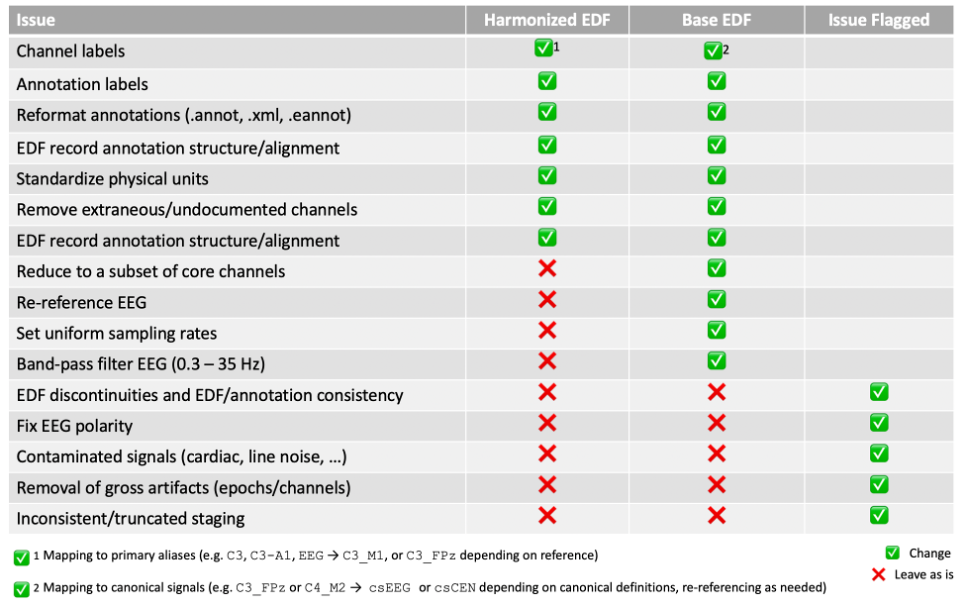
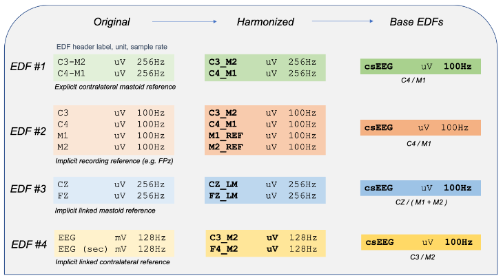

# Harmonizing sleep data across the NSRR

_version 0.2, 7-June-2021_

The NSRR brings together thousands of sleep studies across multiple
cohorts, capturing variation in sleep across broad and heterogenous
populations, from infant to centenarian, in disease and health.  An
unavoidable flipside of this is a corresponding variability in the
technical parameters and standards used across studies.  NSRR data
were generated over several decades, at many different sites, and
employing varying technologies and montages.  Different studies
focused on different populations, and potentially adopted different
approaches to recording and annotation.  Whereas some datasets are
from home-based research studies, others represent clinical
recordings.  Collectively, these factors can raise issues that may
make it challenging to work with NSRR data.  Here, we outline our
strategy for harmonizing studies, aimed at facilitating analyses both
within and across NSRR cohorts.

## Motivating examples

Considering only six NSRR datasets (CHAT, CCSHS, CFS, SHHS, MrOS &
SOF), there are 328 distinct channel labels and 79 distinct
annotations.  A cursory review of these terms shows marked redundancy
and interchangeability of terms, however.  Some examples for channel
labels include:

 - At least six different labels for abdominal effort channels: `ABD`,
   `Abdo`, `ABDO EFFORT`, `Abdominal`, `ABDO RES`

 - Inconsistent use of spaces and capitalization: e.g. `RIGHT LEG1`,
   `Rleg`, `R Leg`, `RLEG`, `Rleg1`, `RLeg1`

 - Nonstandard and inconsistent EEG channels in SHHS: `EEG2`, `EEG 2`,
   `EEG sec`, `EEG(sec)`, `EEG(SEC)`

 - Changes in mastoid labels from `A1/A2` to `M1/M2`

Likewise, annotation labels often vary both within and between NSRR cohorts;

- Diverse sleep stage encodings: e.g. `N2` versus `NREM2` versus `“Stage 2 sleep|2”` versus `2`

- Diverse labels for arousals: e.g.  `Arousal ()`,  `Arousal|Arousal ()`,  `Arousal|Arousal (Arousal)`,  `Arousal|Arousal (Standard)`,  `Arousal|Arousal (STANDARD)`, `Arousal (Asda)`,  `Arousal (ASDA)`

Furthermore, unlike the core signal data which takes advantage of the
European Data Format (EDF) standard, the original NSRR datasets, as
deposited, employ various _ad hoc_ formats for representing annotations,
including XML and tab/comma-delimited plain text, or embedded in an
EDF+.  There are variations in the type of encoding (i.e. intervals
explicitly marked with start and stop times, or a start time plus a
duration, versus only marking the onsets of new annotations; whether
hours/minutes/seconds clock-time is used, versus seconds elapsed from
the start of recording, etc) and, correspondingly, in the formatting
used (i.e. what information is denoted by which field), making it
harder to parse these files in a unified manner.

__CFS example annotations__

```
<?xml version="1.0" encoding="UTF-8" standalone="no"?>
<PSGAnnotation>
<SoftwareVersion>Compumedics</SoftwareVersion>
<EpochLength>30</EpochLength>
<ScoredEvents>
<ScoredEvent>
<EventType/>
<EventConcept>Recording Start Time</EventConcept>
<Start>0</Start>
<Duration>37710.0</Duration>
<ClockTime>00.00.00 20.08.36</ClockTime>
</ScoredEvent>
<ScoredEvent>
<EventType>Respiratory|Respiratory</EventType>
<EventConcept>SpO2 artifact|SpO2 artifact</EventConcept>
<Start>1202</Start>
<Duration>88.8</Duration>
<SignalLocation>SpO2</SignalLocation>
</ScoredEvent>
<ScoredEvent>
```

__WSC example annotations__

```
22:04:41.13     LIGHTS OUT
22:13:11.29     POSITION - LEFT
22:30:59.00     STAGE - N1
22:31:42.64     LM - DUR: 0.7 SEC. - ISOLATED
22:31:58.80     LM - DUR: 1.4 SEC. - ISOLATED
22:31:59.00     STAGE - N2
22:32:59.00     STAGE - W
22:33:10.93     AROUSAL - DUR: 3.0 SEC. - SPONTANEOUS
22:33:59.00     STAGE - N2
22:34:00.47     RESPIRATORY EVENT - DUR: 44.9 SEC. - HYPOPNEA - DESAT 91.6 %
22:34:01.69     DESATURATION - DUR: 55.8 SEC. - MIN 91.6 % - DROP 3.1 %
```

__NCH-SDB example annotations__

```
11442.9765625   0.0     Lights Off
11444.1640625   0.0     Started Analyzer - Data Trends
11447.8359375   0.0     Started Analyzer - Sleep Events
11460.76171875  30.0    Sleep stage W
11490.76171875  30.0    Sleep stage W
11520.76171875  30.0    Sleep stage W
11550.76171875  30.0    Sleep stage W
11580.76171875  30.0    Sleep stage W
11604.75        10.0    Oxygen Desaturation
11610.76171875  30.0    Sleep stage W
11632.8828125   0.0     moving
```

_Side note: EDF+ Annotations._ In theory EDF+ provides support for
annotations existing alongside signals, although in practice EDF+
annotations are difficult to work with for a number of reasons,
e.g. adding sets of derived annotations, or editing existing
annotations entails wholesale restructuring of the EDF+.  Further,
even if EDF+ provided a workable format, there would still be the
unresolved question of the conventions used to denote specific events
and values.

These differences represent avoidable, superficial inconsistencies
that can – and should – be resolved.  While such inconsistencies may
only be minor distractions when manually reviewing studies, they can
present a more serious burden for automated analyses of sleep studies,
in which greater consistency (including case-specific, exact matching
of labels) is more important.

Beyond simple inconsistencies in labels and formats, NSRR studies
often vary in more substantive ways too, including the units, sampling
rates and referencing schemes.  For example, in the CHAT study,
considering just the `C3` EEG channel:

 - some recordings are in microvolts, whereas others are in millivolts

 - sampling rates varies, generally either 200, 256 and 512 Hz 

- some channels are labelled `C3` (presumably referenced to the
  recording electrode, `FPz`) whereas others are re-referenced to the
  contralateral mastoid (labelled `C3-M2` and `C3-A2`)

Naturally, such factors are legitimate differences between recordings,
reflecting actual differences in protocols across data collections,
etc, and are indexed in the EDF headers.  Nonetheless, if overlooked,
they can lead to errors in processing or interpretation.  However, in
addition to these factors, some NSRR studies have misattributions or
ambiguities in the description of the signals.  For example:


- as we [previously reported](http://zzz.bwh.harvard.edu/luna/vignettes/nsrr-polarity/),
  a number of NSRR studies have inverted signal polarities for the
  EEG, and potentially other channels

- as EEG reference channels were not always explicitly stated, many
  studies had an ambiguity or mismatch between the documentation on
  the site (which may have implied that the EEG signals in the EDFs
  were re-referenced to the contralateral mastoid) versus the actual
  EDF

- the sampling rate might sometimes be incorrect (e.g. one CHAT
  individual with a 10 Hz `C3` channel, which is presumably either
  mislabeled or unusable)

- the physical units specified in the EDF header may occasionally be
  incorrect


Another factor is that some NSRR studies contain EDFs that vary in
their technical properties, which could impact certain aspects of the
downstream processing of these files.  Examples include:

  - differences in the overall number or order of channels within a cohort

  - differences in the EDF record size (typically 1 second, but sometimes much larger or a fractional number)

  - rarely, incorrectly specified EDF headers (for example, a sample rate that does not equate to an integer number of samples in the EDF record)   

  - annotations that do not cleanly align to the start of EDF records
    (as illustrated in the above NCH-SDB annotation example), which
    can create a problem if, for example, one wanted to write a new
    EDF containing only a subset of epochs

 - inconsistencies in whether a positive or negative gain
   (i.e. physical minimum > physical maximum) is employed to encode
   signals

Finally, aside from the conventions employed (labels, units,
referencing, etc), in some cases the underlying data are themselves
corrupt or artifact-laden, and sometimes irreparably so, reflecting
problems during the original PSG:

 - signal artifacts from various sources, including cardiac or muscle EEG artifacts, movements, etc  

 - flat/truncated signals, or clearly non-physiological signals (i.e. square-tooth waves) 

 - excessive line noise contamination


In summary, a mix of inconsistencies, ambiguities,
misattributions/errors and occasional technical glitches sit atop the
more ubiquitous signal artifacts that are to be expected in
physiological recordings of this type, and especially those often
conducted outside of the lab, done at scale, and that aim to capture
hours of uninterrupted data.  Taken together, though, these factors
can present challenges in using raw NSRR datasets.  To address these
issues, we propose to distribute three additional classes of data for
every recording in the NSRR:

 - ___harmonized EDFs:___ for both signals and annotations, we apply
   only ‘uncontroversial’ or cosmetic changes, i.e. steps that should
   not fundamentally alter the information within the EDF, but do make
   them easier to work with (by enforcing a greater degree of
   consistency across recordings/cohorts)

 - ___base EDFs:___ aimed at automated processing of studies, including
   automated sleep staging or to facilitate summary visualizations,
   base EDFs extract a subset of core signals, potentially modifying
   those signals (e.g. through re-referencing, re-sampling, or
   filtering), and potentially imposing a many-to-one mapping
   heuristic, to select a single, canonical, “EEG” or “central EEG”,
   or “EMG” channel suitable for subsequent analyses in pipelines that
   are expecting these entities to be defined in this way.  Although
   base EDFs are in large part an intermediate of the NAP (NSRR
   Automated Pipeline), we will distribute them alongside the
   harmonized EDFs, as there are a significant number of applications
   in which these base EDFs may provide a more convenient starting
   point

 - ___issues file:___ this file (one per cohort) flags issues
   encountered with the data, for which a fix is non-trivial, or may
   be done differently by different investigators for different
   analytic purposes

By augmenting the original, deposited data with both harmonized and
base datasets, our goal is to eliminate at least some of the common
issues described above, which will in turn hopefully eliminate sources
of possible error and redundant pre-processing steps that many users
would likely need to duplicate in any case.  The schematic below gives
an overview of the steps involved, with more description in the
following sections. 



## Harmonized EDFs

__Channel labels__ are mapped to NSRR standards via Luna’s [CANONICAL](http://zzz.bwh.harvard.edu/luna/ref/manipulations/#canonical)
command mechanism.  The current mapping file is: 
[`harm.canonical.sigs`](https://gitlab-scm.partners.org/zzz-public/nsrr/-/blob/master/common/resources/harm.canonical.sigs)

Channels that are not defined in this set are dropped from harmonized
EDFs: these are typically extraneous channels present only in a subset
of cases, and/or not well documented.  We enforce a number of rules to
make EDFs easier to work with downstream (e.g. no whitespace
characters in channel names, or inconsistent capitalization).

__Annotations labels__ are similarly mapped, via Luna’s annotation
[remapping mechanism](http://zzz.bwh.harvard.edu/luna/luna/args/#remapping-annotations),
with the same principle of dropping miscellaneous
annotations (e.g. technician notes).  The current list of harmonized
annotation labels is here:

Consistency of __annotation file format__ is enforced by converting
all NSRR annotation data to a set of documented formats, all [described here](http://zzz.harvard.edu/luna/ref/annotations/).

 - `.annot`, a generic interval and epoch-level text-based file format
   used by Luna

 - XML, following the original NSRR XML but with several additions
   such that there can be lossless conversion between XML and .annot

- `.eannot`, a simple one line per epoch format, suitable for sleep
  staging annotations or other epoch-level annotations

That is, the primary consequences of creating a harmonized dataset are
1) changing channel and annotation labels to conform to an NSRR-wide
standard, 2) dropping extraneous channels and/or annotations, and 3)
putting all annotation data in a standard, documented format (likely
`.annot`).  In addition, we perform a couple of other steps, but none
of which fundamentally change the underlying data in a non-trivial
way:

 - standardize units across studies (e.g. uV for EEG)

 - fix any unusual issues with EDF record duration, negative gain and
   EDF physical min/max encoding, and check for issues with EDF
   record/epoch and annotation alignment

- we also check whether the deposited EDF is a standard EDF or an
  EDF+.  In the latter case, we check for any discontinuities in the
  EDF.  We also check that the annotations correspond to the EDF, in
  terms of spanning the relevant time period.  Gross issues are
  flagged.


## Base EDFs

Whereas the _harmonization step_ does not aim to change the underlying
data, creating a so-called _base EDF_ necessarily involves changing the
data.  (Annotation data are not changed at all in this step.)

As described above, the intention of the base EDF is not to represent
the entire contents of the PSG, but rather to extract a subset of
commonly encountered signals (as per the context of a typical PSG),
and to process and label these in a way that – _all other things being
equal_ – will mean that these signals are effectively interchangeable
across studies.  That is, if an automated sleep stager was trained on
NSRR base EDFs, then any study in base EDF format should be able to be
processed by it, as the labels, sample rates, referencing schemes and
units will align.

Further, there is often a redundancy in the signals available in a
PSG, versus what is required for a particular visualization or
analysis.  For example, if only a single, central EEG channel is
expected, this could often be either `C3-M2` or `C4-M2`.  Rather than
force the downstream analysis to have to deal with the range of
potential channels, and decide which to use, the base EDF solves this
issue by simply selecting one or the other, and assigning a standard
label (i.e. `csEEG` or `csC4`).  Likewise, a single `csEMG` channel
reflects a number of possible channels from a harmonized dataset,
i.e. left or right chin, and which may or may not have been referenced
to the central chin, etc.

Currently, the heuristic to select a base channel follows a simple
ordered preference (i.e. if available choose _X_, if not choose _Y_,
otherwise _Z_, etc.). In the future, we will add a level of gross
quality check (for EEG based on overall properties of the (NREM) power
spectrum, and/or consistency with the staging information (i.e. via
the Luna SOAP command).

As notes above, some other steps are performed at this stage,
including band-pass filtering for EEG.

If the restrictions of the base EDF seem too restrictive, simply
ignore it and use the harmonized dataset.

The following schematic illustrates the distinctions between the
original, harmonized and base EDFs for a particular set of EEG
signals, for four example EDFs:



A list of the current canonical signals is available
[here](https://gitlab-scm.partners.org/zzz-public/nsrr/-/blob/master/common/resources/harm.canonical.sigs).

## What harmonization does and does not imply

The primary goal of harmonization is to remove some of the unnecessary
and superficial differences between (and within) NSRR cohorts, and to
achieve a basic consistency of nomenclature and standards, such that
the NSRR-harmonized dataset should suffice for most typical analyses,
with the fundamental scope of the underlying data remaining largely
unchanged compared to the original.


Nonetheless, it is important to stress:

 - reviewing study-specific documentation will still be important to
   understand possible limitations of a given study

 - as well as what may be obvious differences between the populations
   studied in different cohorts, there may be important demographic or
   medical differences between cohorts: it will still be important to
   control for potential nuisance covariates that track with site or
   cohort if performing cross-cohort analyses, whether using
   harmonized or base EDFs

 - harmonized & base datasets may involve some loss of data, dropping
   channels and/or annotations that are deemed uninterpretable or
   unlikely to be of utility

 - there is always a non-zero probability that additional rounds of
   processing introduce new errors, particularly if the input data can
   vary in a large number of ways

__For these and other reasons, we intend to always distribute the original data alongside the harmonized versions.__

## Issue reporting

There is also a potentially large class of occurrences that 1) are
very likely to reflect artifact, and 2) can in principle be at least
partially remedied by analytic approaches.  However, as these “fixes”
are non-trivial, and may not always be successful, or worse, may
introduce may noise into the data when done automatically, we elect to
simply flag these occurrences in an associated `issues.txt` file that
accompanies each cohort.  That is, we make the user aware of this
potential issue, but leave it to the user to treat as they see
appropriate.

Currently, we screen for the following:

 - Grossly bad channels (i.e. long periods with flat signals, etc)

 - Highly unusual, truncated/missing or likely aberrant existing sleep
   staging (e.g. as evaluated via the Luna SOAP command)

 - Likely inverted EEG polarity (e.g. based on SO morphology and/or
   NREM spindle/SO coupling)

 - Severe EEG line-noise contamination in the ‘physiological’
   frequency range (i.e. < 20 Hz)

 - Severe cardiac contamination (e.g. coherence with the ECG /
   time-locked averaging the EEG at R peaks, etc)

The `issues.txt`file will have the following format: tab-delimited
lines, or ID, channel (or ‘.’) if no channel is implied, and a warning
code: e.g.

```
ID001   C3-M2    ABERRANT_SPECTRA
ID077   O1-M2    FLAT_CHANNEL
ID097	.        NO_STAGING
```

## Out-of-scope

Currently, we plan only to detect and report study- or channel level
artifatcs, with a focus on staging and the EEG.  The following are
currently out-of-scope:

 - removing or flagging individual epochs with clear artifact

 - determining whether prior (hardware) filtering of signals has occurred 

 - treatment of ECG and respiratory signals


