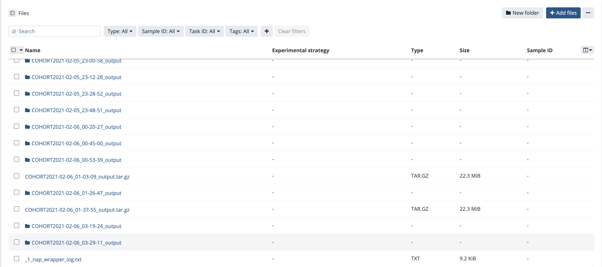

# NAP instance for running in Seven Bridges Platform

## Purpose

Aim of this folder is to provide Sleep researchers with resources to run NAP on Sleep Cohorts within Seven Bridges Platform.

## Pre-requisites

Following are needed to run NAP in Seven Bridges Platform
1. User account in Seven Bridges platform
2. Sleep cohorts as private files within a Seven Bridges project or public dataset info
3. User-defined NAP Configuration file (refer to example file nap_7b.conf in the repo)

## How to run NAP

1. Create new Tool -> Go to Projects -> Choose a project -> Click on  Apps -> 
   "Add App" -> "Create New App" -> "Create a Tool" 

2. Copy the NAP CWL json file content (cwl_nap.json) and paste into the new tool:
   Select the new app -> Click Edit -> Click on Code
   Replace all the default content listed in the Code section with NAP CWL json file content

3. Update the following:
 - As the label is listed as "nap" in NAP CWL json file, this new created tool will be renamed to "nap". If you want to change the tool name, you will have to update the "label" key value with the tool name.

4. Click on Run and Save button at the top right corner.

5. Now, you will be prompted to provide Inputs:
 - definition_dir: Select the folder with sigs.canonical file provided canonical definitions for the specified run name of the study.
 - input_conf: Select the user-defined NAP configuration file
 - input_dir: Select the folder with study files i.e., EDF's and annotation files
 - sigs_alias: Select the file with Signal aliases specific to the study
 - run_name: Input String with value of the run name of the study. (Should match with run name in sigs.canonical file)

6. Once input ports selections is complete, Click on "Run" to start the app

## Output

Output will be listed in the Project's Files section. There are two types of outputs: Wrapper log and 'NAP' output

Wrapper log "nap_wrapper_log.txt" file contains run time terminal log. Whereas 'NAP' output is a set of files and folder generated from the NSRR Automated pipeline. Based on the NAP_OUTPUT variable value in the configuration file, output may be in the form of Folder or Tar file

Successful NAP CWL run output_options

## Notes

1. Please refer to Defaul NAP configuration file (default.conf) for additional configuration options
